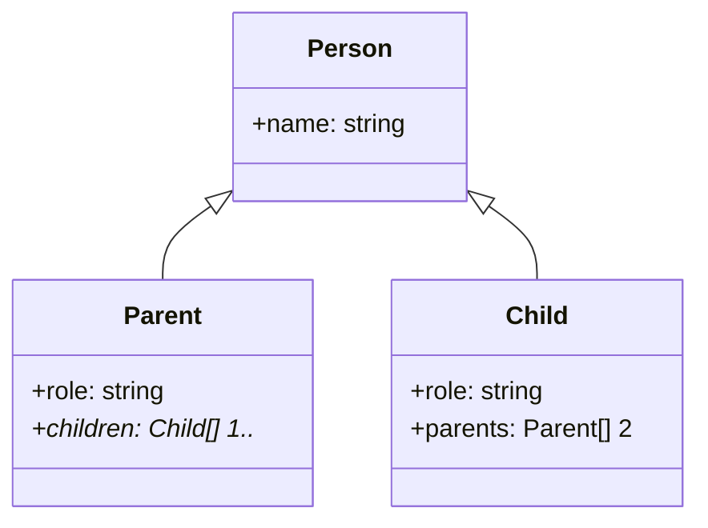
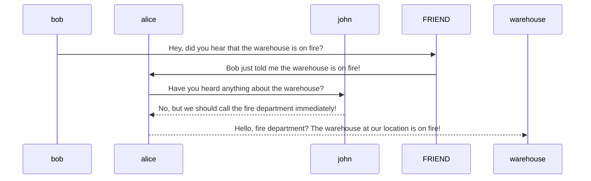
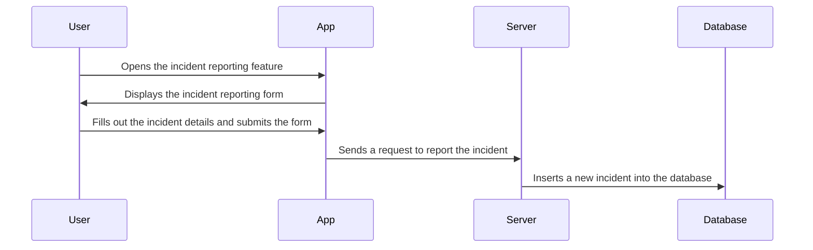

软件工程练习题：
1.面向对象分析方法优于传统方法的根本原因是什么？可否借助图 或其他实例给出自己的理解？

面向对象软件工程是一种动态的思想，模拟人类的思维方式，把现实世界的实体抽象为对戏对象，对象中封装实体的静态属性和动态方法。
同时，对象融合了数据在数据上的操作，对象按照类进行划分，类是对对象的抽象，类与类之间可以构成继承，对象之间的相互练习是通过消息机制实现的，确保了对信息的封装。

2.UML重要的模型

**动态模型**用于对系统的行为随时间变化而进行的建模和描述。它支持活动图，状态图，顺序图

顺序图：用来显示用户，对象，界面和实体之间的交互。它提供了随时间变化，消息在对象间传递的时序图。这些图经常被放于模型用例内来图示用例情形：用户如何与系统交互，内部如何完成任务。通常这些对象用特殊构造型按钮表示，如下图的例子。对象"Login Screen"使用用户接口"User interface"图标.对象"SecurityManager"使用控制器"Controller"图标。" users"使用实体"Entity"图标

活动图：用来显示系统中不同的工作流是如何构造的，它们如何开始，以及它们从开始到结束所可能采用的判断方式。他们也图示某些活动执行中，并行处理可能发生在那里。

状态图用来详细描述系统中，对象经历的状态转移和变化。它们显示一个对象如何从一个状态到另一个状态，以及控制这种变化的规则，通常有一个开始和结束状态。

3.在软件开发过程中，问题发现得越晚，修正起来越困难，付出的代价越高。分析原因，
至少给出两个理由，并简短说明。

问题发现得越晚，所涉及的部分就越多，因为软件开发已经接近完成，问题可能会对软
件开发产生全局性的影响，导致整个项目的失败；而前期发现问题则可以较快地修正，因为
此时往往程序还没有开发完成，和问题相关的部分也相对较少，修改起来成本也更小。

**逻辑模型**是组成设计和分析领域的对象和类的静态视图。通常一个域模型是业务对象和实体的松散、高层视图。而类模型则是更严格，注重设计的模型。这里主要讨论有关类模型的部分。
类模型：类模型是面向对象开发与设计的核心- 它既表达系统的持久状态，也表达系统的行为。
举例：类模型

**物理模型**这个物理/部署模型提供了一个描述组件在系统基础设施中部署的详细模型，它提供了有关网络能力，服务器规范，硬件需求和其它系统部署相关的详细信息。


**用例模型**描述的是新系统规划的功能。它表示用户（人或机器）和系统之间交互的离散单元。该交互是一个有意义的独立单元，如：创建账户，浏览帐户信息。

一个用例描述通常包括：
约束 - 用例运行所遵循的正式规则和限制，它们定义了什么能做，什么不能做。包括：
预置条件是用例运行以前就已经发生了。如："创建订单" <create order>必须发生在"修改订单"<modify order>之前。
后置条件是用例完成后必须为真，如："订单修改和一致性检查"。
常量在用例的整个运行过程中始终为真，如：一个订单一直有客户号。

## Part-1
1.建模的目的是什么?

更好地理解系统或过程，发现问题和优化方案，促进沟通与合作，提高开发效率，改善决策依据

2.一种编程语言是 一种代表算法和数据结构的记号。列举在整个开发过程中使用一种编程语言作为唯 一一种的记号的2条优点和2条缺点

语法规则统一，易于学习和使用。在整个开发过程中，不需要切换不同的语言，可以更快地掌握相关技术和知识，节省学习成本。
可维护性高。由于使用相同的编程语言进行开发，代码风格、接口设计、文档注释等方面都比较统一，易于管理和维护。
适用范围有限。每种编程语言都有其特定的应用场景和优缺点，如果只使用一种编程语言可能无法满足所有需求和问题，需要结合其他语言或工具进行开发。
创新受限。使用单一编程语言进行开发时，可能会受到该语言特性的限制，创新空间相对有限，难以实现特殊的业务逻辑或功能。

3.考感一种你不熟悉的任务，比如设计 一种零排放的汽车。你怎么处理此问题?
- 调研和了解相关领域知识。
- 收集和分析数据。
- 确定设计目标和要求
- 开展实验和测试。
- 持续学习和创新

4.知识荻取不是线性的” 是什么意思?给出 一个能说明这 一点的知识获取实例。
学习并不是从一个单一来源或途径获取固定各种类型的知识，而是由多个渠道和领域之间的相互作用形成的复杂过程。这些渠道和领域可以相互影响和交叉影响，导致学习过程具有多样化和非线性的特点。


5.为 下列设计决策设计一种基本原理:
- “ 售 票 系 统 所 运 行 的 平 台 至 多 1 . 5 m 高 。”
- “ 售票系统要包括两台互为元余备份的计算机系统。”
- “售票系统接又要有一个触摸屏以显示指令和接到命令，还需要有 一个按钮来终止 执行。”
售票系统的平台应该被设计成最多1.5米高，以方便使用者操作。此外，售票系统的各个部件也需要根据人体工程学原则来布置。

由于售票系统的重要性，应设计两个互为元余备份的计算机系统。这样可以确保即使出现一个故障，另一个系统仍然能够正常运行。

为方便用户进行操作，售票系统应该配备一个触摸屏显示器，以显示指令和接收操作命令。还需要一个按钮来终止执行，作为紧急情况下的手动干预措施

6.“售票系统必须让旅客买到周票。”：功能性需求，因为这是售票系统必须具备的特定功能之一。
“售票系统必须用Java编写。”：非功能性需求，因为它涉及系统的实现和技术决策，而不是特定的业务要求。
“售票系统必须易于使用。”：功能性需求，因为用户友好的界面是售票系统必须具备的特征之一。
“售票系统必须随时可用。”：非功能性需求，因为这是一个关于系统的可用性和可靠性的要求。
“售票系统必须在出现故障时提供一个可用的电话号码。”：非功能性需求，因为这是一个关于系统支持和维护方面的要求，而非特定的业务功能。
7.说明 下列决定是在需求设计还是在系统设计时做出的:
- “ 售票系统由一 个用户接又子系统、一个计算价目表子系统和 一个管理与中央计算 机 沟 通 的 网 络 子 系 统 组 成 。”（系统设计）
- “售票系统硬件使用PowerPC处理器芯片。”（系统设计）
- “ 售票系统给旅客提供在线帮助。（需求设计）
  
8.在下面描述中，试解释 account 一词什么时候用作应用域概念、什么时候用作解答域 概 念:
“假设你在开发 一个管理移动用户银行账户的在线系统。 一个主要的设计问题是如何 在客户不能建立在线连接时，让他能进入账户。 一个提议是可以通过移动计算机进入 账户，即使服务器没有上线。在这种情形下，账户显示最后一次连接交易后的数目。”

在这个描述中，"account" 一词被用作解答域概念。

在这种情况下，“account” 指银行账户的具体实例，它是一个包含有关该用户的各种详细信息（例如余额、交易历史记录等）的数据单元。这是解答域概念，因为它指代了真实世界中的具体对象。
此外，该描述中“account”也可以作为应用域概念使用，因为它涉及要设计和开发的特定在线系统的功能和服务。对于这个系统来说，“account”指代了系统内部的特定数据结构或编程对象，负责管理和存储关于用户账户的信息。

应用域概念通常是针对某个特定应用程序中的特定功能或服务，而其定义和实现仅适用于该应用程序。例如，在开发一款电子商务网站时，“购物车”就是一个应用域概念，它只存在于该电子商务网站中，用于存储顾客选择的商品、计算价格等。

解答域则是用来回答问题或解决问题的概念，它与具体的应用程序无关。解答域可以涉及真实世界中的事物、过程或事件，也可以是抽象的数学概念。例如，在解释“如何通过乘法计算两个数字的积”的过程中使用了“乘法”、“数字”等解答域概念。

9.任务和活动的区别在哪里 ?
定义：任务（Task）是指分配给某个人或组织完成的特定工作或职责，需要在规定的时间内完成；而活动（Activity）则是指人们为了达成某个目标而进行的行为或操作。

- 时间限制：任务通常都有明确的时间要求和截止日期，需要在规定的时间内完成；而活动通常可以根据实际情况和需要进行调整，没有明确的时间限制
- 目标限制：任务是为了完成某个具体的工作，达到某个预期的结果
- 复杂度：任务相对于活动来说，更加复杂和困难，

10.一架 客 机 由 几 百 万 个 零 件 构 成 且 需 要 成 千 上 万 的 人 来 安 装 。 一 个 四 车 道 的 高 速 公 路 桥是又一个复杂性的例子。Windows 下的word第一个版本，由微软1989年发行的 字处理器需要55 人工作 一年，生成249000 行源代码，晚4 年才交付。飞机和高速 公路桥通常能如期交付，而软件通常不能如期交付。依你的观点，讨论造成这种情 形的 飞机、高速公路桥的开发与字处理器开发的差别

其开发过程中可能会涉及多个层面，例如需求定义、架构设计、编码和测试等。如果在任何一个环节出现问题，都可能会导致项目延误或者失败。

## Part-2

### UML 

- 用例图：需求获取和分析-表示系统功能（参与者）。从用户角度展示系统功能，定义了系统边界。
- 类图：标识系统结构
- 交互图：系统行为形式化，对象之间的通信可视化。顺序图是交互图的特殊形式。顺序图吧把关注点放在对象之间的信息交换上。使用一组对象之间的交互表示系统的行为。
- 状态机：用一组状态以及状态之间你的迁移描述耽搁对象的动态行为。状态机把关注点放在状态之间的迁移上。结果：一个独立对象产生了外部事件。表示非平凡对象的行为
- 活动图:活动图利用活动描述了一个系统的行为。活动表示：操作集合执行的建模元素。圆角矩阵表示活动，活动之间的箭头表示迁移。短粗棒表示控制流同步。表示贯穿一个系统的数据流图或者控制流图。

### 关系

- 继承/泛化关系是带空心三角形的直线（动物和鸟）
- 实现关系是带空心三角形的虚线（大雁和飞翔）
- 关联关系带箭头的实线（企鹅要知道气候变化）
- 聚合关系带空心四边形的箭头（雁群和大雁）
- 组合关系是带实心四边形的箭头（鸟和翅膀）
- 依赖关系是带箭头的虚线（动物和空气）


### 面向对象建模

应用域：用户问题的所有方面-（面向对象分析关注的是应用域的建模
解答域：可能系统的建模空间-（面向对象设计关注的是解答域的建模

#### 用例图的表示

参与者通常是指系统外部和直接与系统交互的用户、设备或其他系统。在用例图中使用一个包含名称的符号来表示参与者


+-------------+
|   Actor     |
+-------------+
| -attribute  |
| +operation()|
+-------------+

用例是指系统中某个功能或服务的完整描述，它展示了系统对外提供的各种操作和响应。在用例图中使用椭圆形状的符号来表示用例。

+--------------+
|    Use Case   |
+--------------+
| - attribute   |
| + operation() |
+--------------+

参与者和用例通过关联关系联系在一起，表示参与者与所请求的用例之间的交互。

+-------------+             +---------------+
|   Actor     |<>--------->|     Use Case   |
+-------------+             +---------------+

按照如下格式完成列车售票系统的用例图。该系统包括两个参与者:可以购买不同类型车票的旅客 和中心计算机系统管理一个价格表引用数据库。用例应该包括 BuyOneWayTicket、 BuyWeeklyCard、BuyMonthlyCard 和 UpdateTariff。也应该包括意外情况:TimeOut (即旅行者等待太长时间而无法输入正确的数量)、TransactionAborted (即旅行者选择 终止按钮，未完成交易)、DistributorOutOfChange 和DistributorOutotPaper。

| 用例名   |      |
| -------- | ---- |
| 参与者   |      |
| 事件流   |      |
| 入口条件 |      |
| 出口条件 |      |
| 质量需求 |      |


通信关系：

- 包含关系
- 扩展关系
- 继承关系

#### 交互图的表示
 交互图描述了一组对象之间的通信模式。一个对象通过发送消息和其他对象进行交互

 - 顺序图：表示交互的横向和表示事件的纵向。
 - 协作图

#### 状态机的表示

- 小黑实心圆表示初始状态。
- 迁移提供连接两个状态的开箭头表示
- 套有实心黑元表示终止状态。
- 状态：圆角矩阵

#### 活动图的表示

- 决策是控制流中的分支
- 分叉节点代表把控制流分成多个线程
- 回合节点表示多个线程之间的同步
  

### 练习

1.考虑 一下ATM 系统。至少标识出与系统交互的三个不同的参与

答：用户：使用ATM机提取现金、查询余额或转账等服务的人。

银行/开发商：银行和开发商需要指定要开发的功能，提供安全性和与银行帐户集成的支持。

管理员：有权管理ATM机，例如维护ATM机硬件和软件、配置ATM机系统、添加新功能等。

2.在考虑一个系统时，是否可以将该系统作为 一个参与者处理?验证你的答案

答案：在考虑一个系统时，可以将该系统作为一个参与者处理。例如，ATM机可以被视为ATM系统中的一个参与者，因为它积极地参与了与用户交互和执行操作的过程。然而，在对系统进行分析和设计时，通常会更多地关注系统的组件、模块或服务等内部实现细节，而不是将整个系统视为一个独立的参与者。因此，是否要将系统本身视为参与者取决于具体情况和需要分析的问题。

3.场景和用例之间，有何不同?这两个工具在何时使用?

场景（Scenario）通常描述了一个系统或应用程序在特定情境下的一系列行为或步骤。每个场景通常都**包含了一个或多个参与者、事件和条件，并描述了这些东西如何相互作用和影响系统的行为**。通常使用场景来帮助识别潜在问题、验证需求、设计用户体验等。场景更加关注用户与系统的交互过程，对用户体验、用户需求等方面的把握更为准确。

用例（Use Case）也描述了系统在特定情况下执行的一组操作。但是，用例比场景更加强调系统的功能需求和行为，而不是用户体验。用例往往关注于描述系统角色（Actor）和系统间交互、系统能够完成的功能以及其限制和前提条件等内容。用例主要用来描述系统的功能列表，对系统的描述更加全面，且更适合从开发人员和系统架构师的角度出发进行分析和设计。

4.画出列车售票系统的用例图。该系统包括两个参与者:可以购买不同类型车票的旅客 和中心计算机系统管理一个价格表引用数据库。用例应该包括 BuyOneWayTicket、 BuyWeeklyCard、BuyMonthlyCard 和 UpdateTariff。也应该包括意外情况:TimeOut (即旅行者等待太长时间而无法输入正确的数量)、TransactionAborted (即旅行者选择 终止按钮，未完成交易)、DistributorOutOfChange 和DistributorOutotPaper。


用例名	
BuyOneWayTicket	旅客购买单程车票
BuyWeeklyCard	旅客购买周票
BuyMonthlyCard	旅客购买月票
UpdateTariff	中心计算机系统更新价格表
参与者	旅客、中心计算机系统
事件流	1. 旅客选择需要购买的车票类型
2. 系统检查旅客账户余额是否充足
3. 旅客输入购票数量
4. 系统计算总价并显示给旅客确认
5. 旅客确认购票
6. 系统完成交易并将车票发送给旅客

备注：对于UpdateTariff用例，事件流为中心计算机系统管理员上传新的价格表到数据库
入口条件	旅客已经登录，中心计算机系统和数据库正常运行
出口条件	交易成功，车票已经发送给旅客
质量需求	系统应该保持高可靠性、稳定性和安全性，旅客和系统管理员应该能够轻松易懂地操作系统
意外情况：

用例名	
TimeOut	用户等待输入超时
TransactionAborted	用户未完成交易选择终止
DistributorOutOfChange	分销商无法找零
DistributorOutOfPaper	分销商缺乏票据


5.写出题-4事件流并说明用例Update Tariff的所有域

6.按如下定义要求面出书的类圈:“一本书由数个部分组成，每个部分由数章组成。各 章又由数节组成”。画图的将注意力放在类及其关系

+---------+        +--------+       +-------+
|   Book  |        |  Part  |       |Chapter|
+---------+        +--------+       +-------+
|         |        | Chapter|......>|       |
|         |        |  int   |       | int   |
|String[]|        | Section|       +-------+
|         |......>|        |
|         |        |        |
+---------+        +--------+

7.在你完成的练习6的基础上，在类图中增加重数

8.画出对象图， 以表示本书的第一部分 (即第一部分 ， 准 备开始)。 确认你所画出的对象图与练习6中的类图一致

9.扩展练习2- 6中的类图 ， 以包含如下属性 :
书中包括出版者 、 出版日期和ISBN
一个部分包括一个标题和一个数字
一章包括 一个标题、 一个数字和一个摘要
一节一个标题和一个数宇

10.考虑一下练习9中的类图。注意到Part、Chapter 和Section 均包括一个标题和 一个 数字。增加 一个抽象类和继承关系，以将这些属性提到抽象类中

11.画出表示家长与孩子之间关系的类图。利用 一个人可以由双亲和 一个孩子。对具有角色和重数的关联加注


继承

12.对著书目录的参考文献画一个类图。使用附录C 中的参考文献Bibliography，以测试 你的类图。你的类图应该尽可能细化。

13.画出图2-21的场景warehouseOnFire 的顺序图。包括对象bob、alice、john、FRIEND 和你所需要的其他类的实例。仅画出前 五个消息发送


- bob 向他的朋友 FRIEND 发送信息询问是否知道仓库着火的消息。
- FRIEND 告诉 alice，仓库着火的消息。
- alice 向 john 询问有没有听说过关于仓库的事情。
- alice 向 john 询问有没有听说过关于仓库的事情。
- john 回复说他没听到，但是他们应该立即打电话给消防局！
- alice 打电话给消防局报告仓库起火的情况。

13.图2-14 的用例Reportincident 的顺序图。仅画出前五个消息发送。确认与练 习2-13 中的顺序图一致。



14.用例Reportincident 的顺序图
```
@startuml
FieldOfficer -> FRIEND: 激活“报告紧急情况”功能
FRIEND --> FieldOfficer: 响应表格提交请求
FieldOfficer -> FRIEND: 提交填写好的表格
FRIEND --> Dispatcher: 通知调度者有紧急情况报告
Dispatcher -> Dispatcher: 评估信息并创建事件
Dispatcher -> FRIEND: 显示响应并传达给现场工作人员
@enduml
```
15.通过电话订购一份比萨饼的过程。画出活动图表示该过程的每 一步，从你 拿起电话的那一时刻开始，到你开始吃比萨饼这一时刻为止。不必表示任何意外情 况，包括其他需要处理的活动。

```
@startuml
|客户|
start
:拿起电话;
|员工|
:问候客户;
:询问客户需求;
|客户|
:告知所需比萨饼;
|员工|
if(比萨是否有优惠活动?) then(yes)
    :告知客户优惠信息;
else (no)
    :告知客户总价;
endif
:确认订单;
|客户|
:提供送货地址;
|员工|
:确认地址和联系方式;
fork
    :制作比萨;
fork again
    :配送比萨;
end fork
|客户|
:签收比萨;
stop
@enduml

```


16.对你开发的练习15 的活动图增加一条异常处理。至少考虑三种异常 (例如接电话 者 记 错 了 号 码 、 外 卖 者 给 出 了错 误 的 比 萨 饼 、 存 储 不 下 ) 。

17.根据软 件 开 发 活 动 。第 一 个 活 动 图 要 求 : 画出活动图表示这些活动，假设这些活动严格按顺序执行。第 二个活动图要求:画 出以增量方式发生时相同活动的活动图 《即包括分析、设计、实现和测试在内的系 统的一部分开发完成之前，系统的另一-部分开发已经开始。第三个活动图要求:画 出描述这些相同活动并发发生时的活动图。


```
@startuml

|客户|
start
:提出需求;
|分析师|
:分析需求;
|设计师|
:设计系统;
|程序员|
:实现系统;
|测试人员|
:测试系统;
|客户|
:验收系统;
stop

@enduml

```
@startuml

|客户|
start
:提出需求;
|分析师|
:分析需求;
|设计师|
:设计系统;
|程序员|
:实现系统;
|测试人员|
:测试系统;
|客户|
:验收系统;
stop

@enduml

```
@startuml

|客户|
start
:提出需求;
|分析师|
:分析需求;
|分析师|
:撰写需求文档;
|设计师|
:设计系统;
|设计师|
:编写接口规范;
|程序员|
if (有新任务) then (是)
  :实现新功能;
else (否)
  :完善已有功能;
endif
|测试人员|
if (有新任务) then (是)
  :测试新功能;
else (否)
  :测试已有功能;
endif
|客户|
if (满意) then (是)
  :继续开发下一阶段;
else (否)
  :修改及迭代;
endif
|程序员|
:实现需求;
|测试人员|
:测试需求;
|客户|
if (满意) then (是)
  :进入下一阶段;
else (否)
  :修改及迭代;
endif
stop

@enduml

```

```
@startuml

|客户|
start
:提出需求;
|程序员|
fork
  :实现系统;
  fork again
  |分析师|
  :分析需求;
  |设计师|
  :设计系统;
  |测试人员|
  :测试系统;
  fork end
join
|客户|
:验收系统;
stop

@enduml

```

## Part3

### 项目组织和沟通

1.角色和参与者之间的区别是什么?


角色 是指在系统设计中确定的一组相关职责、权限和行为模式。角色通常是在系统设计过程中确定的，可以是人、机器或其他实体。**角色定义了系统中各个活动的主要责任方，并规定了他们在项目中的工作方式。**例如，在一个电商平台上，可能会有买家、卖家和管理员等角色。

参与者 则是指在特定操作期间直接与系统交互的实体。参与者是系统用户的具体身份，是系统中最终用户或外部系统与该系统进行交互的其他应用程序或服务。例如，在一个银行系统中，可能会有存款人、出纳员和贷款审批官等参与者。

**角色更多是从系统架构或设计的角度考虑，而参与者则更加侧重于实际的使用场景和互动操作。**

2.两个和多个参与者之间，角色可以共享吗?如果是的话，是何原因?如果不是的话， 又是何原因

不同的参与者在系统中具有相同的职责、权限和行为模式的时候角色可以共享。参与者之间的角色不同时，就不能

3.客户和最终用户有何区别?

客户是购买软件或服务的组织或个人，他们对软件有决策权，可以指定要求和功能，并为软件支付费用。而最终用户是实际使用软件的人员或受益人，他们与软件直接交互，使用软件来完成任务或获得价值。

4.根据如下任务，你将承担的角色是什么?
- 改变一个子系统接又以适应新的需求 。
- 因子系统接又的改变而与其他项目团队进行沟通。
- 因接口的改变而改变文档 。
- 设计测试用例组以检查因改变而引入的错误。
- 确信所进行的改变在计划安排内可完成。
  
5.你将负责协调一 个处理银行信用卡系统的开发。对该项目而言，对以 下项目参与者而 言，谁最为合适担当此角色?
一 个银 行 雇 员对 处 理 信 用 卡应 用 负 责 。
在银行中的信息技术组经理，其将定义系统。
一个 具有过开发相似系统的自由程序 员。
一个技术性的写作者。

6.绘出 一个UML 活动图以表示在第3.4.1 节中描述的会议过程。在该会议前后，特别注 意所产生的产品，如会议议程和会议时间。使用泳道图表示角色。

7.工作包和 工作产品有何区别?在何时定义工作包?在何时定义工作产品?考虑如下 安排:有两个学生合作规划和开发一个系统，使用两个不同的排序算法用以对姓名表进行排序。对分工而言，所提交的内容包括源代码、系统文档和对其他开发者解释新排序算法如何集成到代码的手册。根据这一项目，给出工作包和工作产品的实例。

工作包：源代码、系统文档、说明手册并不是工作包，而是工作产品。工作包是一个可以独立管理和控制的工作单元，通常会包含诸如工作任务、资源需求、进度计划等信息。而工作产品则是指在完成某个工作包时所需要创建、提交或交付的具体成果，如软件程序代码、技术规格说明、测试报告等等。在开发排序算法这个项目中，工作包可能包含多个任务，而每个任务都可能涉及不同的工作产品，其中包括源代码、系统文档和说明手册等。


## Part4

1.考虑将你的表作为系统，并将时间向前拨 2 分钟。写出你和你的 手表之间进行交互的场景 。记录下所有场景 ， 包括手表提 供 给 你 的 任 何 反 馈 。

场景1:

我：想要知道现在几点了。
手表：显示当前时间为XX:XX（比实际时间晚了2分钟）。
场景2:

我：想要设置一个闹钟提醒我下午2点要参加会议。
手表：确认我已经按下了设置闹钟的按钮，并且显示已设置闹钟时间为13:58。
场景3:

我：试图开启手表上的计时器以记录跑步时间。
手表：开始计时，并显示已计时0秒（实际计时器比实际时间慢了2分钟）。
场景4:

我：尝试使用手表上的计步器检查今天走了多少步。
手表：显示今天还没有行走步数数据。

2.景标 识 出 该 场 景 的 参 与 者 。接 下 来 ，写 出 对 应 的 S e t T i m e 用例。包括向前和向后设置时间的所有用例，以及设置小时、分钟和秒钟的所有用例。

**场景：**
- 参与者：我和我的手表。
- 描述：我想要将手表上的时间向前拨2分钟。

**SetTime用例：**
- 参与者：我和我的手表。
- 触发器：我想要更改手表上的时间。
- 前置条件：手表处于待机状态，时间设置模式未开启。
- 后置条件：手表上的时间更新为新设置的时间。

**向前设置时间用例：**
- 参与者：我和我的手表。
- 触发器：我想要将手表上的时间向前调整一段时间。
- 前置条件：手表处于待机状态，时间设置模式已开启。
- 后置条件：手表上的时间已按照设定时间向前调整。

- 用户提供想要向前调整的小时数、分钟数和秒数
- 手表验证输入是否合法，如果不合法则提示用户重新输入
- 手表将当前时间向前调整相应的小时数、分钟数和秒数
- 手表显示更新后的时间

**向后设置时间用例：**
- 参与者：我和我的手表。
- 触发器：我想要将手表上的时间向后调整一段时间。
- 前置条件：手表处于待机状态，时间设置模式已开启。
- 后置条件：手表上的时间已按照设定时间向后调整。

- 用户提供想要向后调整的小时数、分钟数和秒数
- 手表验证输入是否合法，如果不合法则提示用户重新输入
- 手表将当前时间向后调整相应的小时数、分钟数和秒数
- 手表显示更新后的时间

**设置小时用例：**
- 参与者：我和我的手表。
- 触发器：我想要单独更改手表上的小时。
- 前置条件：手表处于待机状态，时间设置模式已开启。
- 后置条件：手表上的小时已按照设定时间进行更改。

- 用户提供新的小时数
- 手表验证输入是否合法，如果不合法则提示用户重新输入
- 手表将当前时间的小时更改为新的小时数
- 手表显示更新后的时间

**设置分钟用例：**
- 参与者：我和我的手表。
- 触发器：我想要单独更改手表上的分钟。
- 前置条件：手表处于待机状态，时间设置模式已开启。
- 后置条件：手表上的分钟已按照设定时间进行更改。

- 用户提供新的分钟数
- 手表验证输入是否合法，如果不合法则提示用户重新输入
- 手表将当前时间的分钟更改为新的分钟数
- 手表显示更新后的时间

**设置秒钟用例：**
- 参与者：我和我的手表。
- 触发器：我想要单独更改手表上的秒钟。
- 前置条件：手表处于待机状态，时间设置模式已开启。
- 后置条件：手表上的秒钟已按照设定时间进行更改。

- 用户提供新的秒钟数
- 手表验证输入是否合法，如果不合法则提示用户重新输入
- 手表将当前时间的秒钟更改为新的秒数
- 手表显示更新后的时间


3.手 表 实 例 也 支 持 闹 钟 特 征。 描 述 将 闹 钟 时 间 设 置成称为Set AlarmTime 的自包含的用例。
   
**设置闹钟时间用例：**
- 参与者：我和我的手表。
- 触发器：我想要设置手表的闹钟时间。
- 前置条件：手表处于待机状态。
- 后置条件：手表上的闹钟时间已按照设定时间进行设置。

- 用户提供新的闹钟时间，包括小时数和分钟数。
- 手表验证输入是否合法，如果不合法则提示用户重新输入。
- 手表将当前闹钟时间更改为新的闹钟时间。
- 手表显示更新后的闹钟时间。
- 如果手表当前时间等于新设置的闹钟时间，手表响铃提醒用户。


4.检查你在练习4-2 和练习4-3 中所写出的SetTime 和SetAlarmTime 用例。通过使用包 含关系抽取任何元余。说明在这一用例中，与使用扩展关系相比，为什么包含关系是 优先。

**包含关系抽取出的元素：**

- 设置时间用例：
  - 参与者：我和我的手表。
  - 触发器：我想要设置手表的时间。
  - 前置条件：手表处于待机状态。
  - 后置条件：手表上的时间已按照设定时间进行设置。
  - 流程：
    1. 用户提供新的时间，包括小时数和分钟数。
    2. 手表验证输入是否合法，如果不合法则提示用户重新输入。
    3. 手表将当前时间更改为新的时间。
    4. 手表显示更新后的时间。

- 设置闹钟时间用例：
  - 参与者：我和我的手表。
  - 触发器：我想要设置手表的闹钟时间。
  - 前置条件：手表处于待机状态。
  - 后置条件：手表上的闹钟时间已按照设定时间进行设置。
  - 流程：
    1. 用户提供新的闹钟时间，包括小时数和分钟数。
    2. 手表验证输入是否合法，如果不合法则提示用户重新输入。
    3. 手表将当前闹钟时间更改为新的闹钟时间。
    4. 手表显示更新后的闹钟时间。
    5. 如果手表当前时间等于新设置的闹钟时间，手表响铃提醒用户。

在这个用例中，包含关系比扩展关系更合适，因为设置闹钟时间的用例包含了设置时间的用例。设置时间是设置闹钟时间所必需的子步骤。使用包含关系可以避免在两个用例之间出现重复步骤，从而使用例更简洁、易读和易于维护。此外，使用包含关系还可以将这些用例分别测试并独立验证其正确性。


5.当满足报告紧急情况EmergencyReport 时，假设现场工作人员FieldOficer将引用Help 特征。对每一个领域，Help 报告紧急情况ReportEmergency 特征提供了细节描述，说 明了哪一个域需要这些细节。修改报告紧急情况ReportEmergency用例(在图4-10 中 描述)以包括这一帮助功能。在报告紧急情况ReportEmergency 和Help 报告紧急情況 ReportEmergency 之间，你应该使用哪一种关系?

6.关 于以 下非 功 能 性 需 求 的 一 些 例 子 。 说 明 哪 些 需 求 是 能 证 实 的 ? 哪 些 不 能 :
“ 系 统 必 须 是 可 用 的 。”（无法被证实）
“ 在一秒钟的时间内，对一个提交的命令，系统必须提供可见的反馈给用户。（可以证实的非功能性需求）
“ 系统的有用性必须达到95 %以上。”(是一个不太容易证实的非功能需求，)
“ 新系统的用户界面应该 与原有的旧系统用户界面是够相似， 因为这样做后，在对 新 系 统 进 行 培 训 时 ， 将 更 加 容 易 。”(这是可以证实的非功能性需求。)

>非功能性需求是指系统需满足的性能、安全、可靠性、易用性等要求，而不是特定的业务需求或功能要求。

功能性需求

用户能够创建新账户
系统能够查询并返回正确的数据信息
用户能够将商品添加到购物车中
系统能够接受和处理用户提交的订单
非功能性需求

系统必须在3秒内响应用户的查询请求
系统必须支持至少1000个并发用户
系统必须具有高可靠性，即系统不会在运行过程中出现错误，或者发生故障时能够快速恢复
系统必须保护用户隐私，严格遵守相关法律法规

7.分析员可能会遇到开发 一个完整的规格说明的需要，这时分析员将写出详细的文档。 为 了鼓励分析员保持规格说明 (表4- 1 中)尽量短，哪一种规格 说明的质量更具竞争 性?

8.在需求和随后的活动过程中，维持可跟踪性是代价昂贵的，因为这必须要捕捉和维护 额外的信息。高于这 一期待的可跟踪性好处是什么?哪 一个好处对分析员而言是直接 的好处?

降低开发风险：通过跟踪需求变更，可以及时捕获任何潜在的风险，并采取相应的措施，减少项目失败或超支的可能性。

改进需求质量：通过更好地理解需求背景、业务目标和用户期望，可以提高需求的质量并减少歧义和误解的可能性。

提高团队协作效率：通过创建一个共享的需求库，团队成员之间可以更好地协作和交流，并维护共同的理解和对需求状态的认识。

加强项目管理：通过明确的需求基准线和开发进度监视，可以更好地管理项目进度和资源分配。


9.解释为什么作为从用户处抽取信息的主要手段的多种选择调查表，会对抽取需求是无 效的。
 缺乏上下文信息：调查表通常只能提供零散的信息，而缺乏引导性和上下文，这使得我们很难深入了解用户的真正需求。在没有足够背景知识和上下文的情况下，用户往往难以精确表达自己的需求。

忽略非言语要求：调查表主要关注文字信息，但存在很多无法通过问卷或调查表收集的用户需求。例如，用户的使用场景、心理暗示、口头表述等都可能包含重要的需求信息，但这些往往无法从纸面调查中获取。

误导性：调查表设计不当，很容易导致受访者误解或错误回答问题，这可能导致我们所获得的数据失真，进而导致对需求的错误理解。

10.站在你的观点上，描述在需求获取活动中用户的优点和缺点。同样地， 描述在需求 获取活动中开发者的优点和缺点。

用户的优点：真实且具体：用户了解他们自己的需求，并能真实地反映他们在日常生活和工作环境中所遇到的问题，提供具体的使用场景和案例。启发式思维：用户在日常使用产品或服务时会形成自己的习惯和方式，他们的交互方式和习惯可能会启发我们进行更好的设计。集成思考：用户往往可以为团队带来不同的视角和观点，帮助开发团队整合多方面的需求。


开发者的优点：技术专业性：开发者理解技术和代码，这使得他们可以准确地评估用户的需求，并将需求转化为产品设计和开发中的技术方案。

创造性思维：开发者可以提供先进的技术和创新的解决方案，这是用户可能从未考虑过的，能够达到满足用户需求的目的。

沟通协调能力：开发者可以对用户的需求进行分析和解释，并与用户保持沟通，以便更好地把握需求，逐步迭代产品，确保最终产品能够满足用户的需求。

11.简要定义术语“英单” 。在纸上写出你的回答，并将之放到另外西个学生给出的定 义中，并将这五个定义混在 一起。比较这五个定义并讨论这些定义的不同


## Part5

1.考 惠 一下 带 有 图 形 用 户 界 面 的 文 件 系 统 ，如Macintosh的Finder 、Microsoft的Windows Explorer和 Linux 的KDE。从描述怎样从一个软盘复制一个文件到硬盘的用例中标识 出了如下对象:File、Icon、TrashCan、Folder、Disc 和Pointer。说明哪些对象是实体 对象，哪些对象是边界对象，哪些对象是控制对象


- Macintosh的Finder是苹果电脑的图形化文件管理器
- Microsoft的Windows Explorer是Microsoft Windows操作系统中的本地文件管理器
- KDE是Linux操作系统中的一个桌面环境，具有图形用户界面，包括文件管理器Dolphin。Dolphin提供了各种功能，例如以不同方式查看文件，创建压缩文件等。

- File（文件）：表示软件包含的数据或信息。（实体）
- Icon（图标）：代表文件、文件夹、磁盘等。（边界对象）
- TrashCan（垃圾桶）：表示丢弃文件或文件夹的区域。（边界对象）
- Folder（文件夹）：用于组织和存储文件。（实体）
- Disc（磁盘）：通常表示可移动介质，如软盘或 USB 驱动器。（实体）
- Pointer（指针）：用于指示应用程序正在处理的对象。（控制对象）

>实体对象：包括文件、文件夹和磁盘。它们是在文件系统中**实际存在**的物理实体。
> 边界对象：包括图标和垃圾桶。它们是用于将**实体对象呈现**给用户的虚拟元素。
> 控制对象：指针用于控制**用户与其他对象的交互**方式。

2.假 设 如 前 所 达 的 同 一 文 件 系 统 ， 考 虑 一 个 包 含 了 从 软 盘 上选 择 文 件 并 拖 动 该 文 件 到 Folder 再释放鼠标的场景。标识和定义至少一个关联到此场景的控制对象


- 文件选择器：负责显示软盘上的文件列表并允许用户选择要移动的文件。它还将捕获用户从软盘上拖动文件的操作，并将该文件传递给系统以进行后续处理。

- 鼠标指针：表示用户正在执行拖放操作。在这个场景中，鼠标指针的状态将随着用户在屏幕上移动而改变，以便提供反馈并帮助用户精确定位他们所选的文件和目标文件夹。

- 鼠标指针：表示用户正在执行拖放操作。在这个场景中，鼠标指针的状态将随着用户在屏幕上移动而改变，以便提供反馈并帮助用户精确定位他们所选的文件和目标文件夹。


3.在顺序图中水平地排列练习5-1和练习5-2中列出的对象，將边界对象放在左边，将 你要标识的控制对象放在中间，将实体对象放在右边。画出将文件拖入文件火的交互顺序。在本题中，忽略异常情况。

```paltuml
@startuml
skinparam monochrome true

actor User
participant "Disk" as Disk
participant Screen
participant Folder

User -> Screen: 1. 打开文件管理器
activate Screen

User -> Disk: 2. 从软盘上选择文件并拖动
activate Disk

Screen -> Disk: 3. 请求打开软盘
Disk --> Screen: 4. 显示软盘中的文件列表
deactivate Disk

User -> Screen: 5. 选择要拖动的文件
User -> Screen: 6. 拖动所选文件到Folder上
User -> Folder: 7. 释放鼠标
activate Folder

Screen -> Folder: 8. 发送移动文件请求
deactivate Screen
Folder -> Screen: 9. 移动文件成功
activate Screen

@enduml

```

4.检查你在练习5-3 中面出的顺序图，标识出这些对象之间的关联

User与Screen之间的关联为：用户打开文件管理器，并选择了要拖动的文件。
User与Disk之间的关联为：用户从软盘上选择了文件并拖动。
Screen与Disk之间的关联为：屏幕向磁盘发出请求打开软盘，并显示软盘中的文件列表。
User与Screen之间的关联为：用户选择要拖动的文件，并将其拖动到Folder上。
User与Folder之间的关联为：用户释放鼠标，完成文件拖动操作。
Folder与Screen之间的关联为：Folder向屏幕发送移动文件请求，屏幕完成了文件移动操作。

5.标 识 出 与场 景 ( 将 一 个 文件 从 一 张 软 盘 拷 贝 硬 盘 )相 关的 每 一 个对 象 的 属 性 。 考虑 如 下异常情况“在该文件夹中存在同 一文件名” 和“磁盘中没有足够的空间”。

```
@startuml
skinparam monochrome true

actor User
participant "Floppy Disk" as FloppyDisk
participant Screen
participant "Hard Disk" as HardDisk
participant FileManager

User -> Screen: 1. 双击打开文件管理器
activate Screen

Screen -> FloppyDisk: 2. 启动并打开软盘驱动器
activate FloppyDisk
FloppyDisk --> Screen: 3. 显示软盘中的文件列表
deactivate FloppyDisk

User -> Screen: 4. 在文件管理器中选择要复制的文件
User -> FileManager: 5. 点击“复制”按钮
activate FileManager

FileManager -> Screen: 6. 打开“复制窗口”
Screen -> HardDisk: 7. 请求打开目标文件夹
activate HardDisk
HardDisk --> Screen: 8. 显示目标文件夹中的文件列表
deactivate HardDisk

User -> Screen: 9. 选择目标文件夹
User -> Screen: 10. 点击“粘贴”按钮
Screen -> HardDisk: 11. 将文件拷贝到目标文件夹
activate HardDisk
HardDisk -> Screen: 12. 显示拷贝进度条
deactivate HardDisk
Screen -> User: 13. 显示“拷贝完成”提示消息
deactivate Screen
User -> Screen: 14. 关闭文件管理器
activate Screen

note left of FileManager: 如果目标文件夹中已经存在同名文件，则弹出“覆盖确认”窗口。
note right of HardDisk: 如果磁盘空间不足，则拷贝操作中止并弹出错误消息。

@enduml

```
  
Screen代表了一个界面或显示区域。在这个场景中，用户的交互和计算机的响应会通过屏幕来完成，也就是用户通过选择某些操作然后在屏幕上看到结果。因此，在这个场景中，需要有一个表示屏幕或者界面的元素来帮助展示这些交互和响应过程。例如，用户可以通过屏幕来打开文件管理器，选择要复制的文件，然后粘贴到目标文件夹中。拷贝进度和错误消息也需要在屏幕上显示。

在UML时序图中，屏幕、窗口和对话框等UI元素通常被表示为参与者（actor）或对象（participant），用来表示它们在各种场景中所扮演的角色。因此，在这个场景中，Screen作为一个表示屏幕的对象，可以帮助我们更清晰地理解整个过程的执行顺序和各个实体之间的协作关系。


6.给出有关Gregorian 日历的知识，列出有关该模型的所有问题。修改该模型的每一个 问题。
月份长度不规则：Gregorian 日历中月份的长度各不相同，有31天、30天、29天或28天（闰年2月为29天）。这个问题导致了日期计算变得复杂，从而使很多程序员很难编写一个稳定可靠的日期处理算法。

闰年规则复杂：虽然闰年出现的频率有一定的规律，但Gregorian 日历中的闰年规则比较复杂，即每四年一闰，但跨世纪的年份要特殊考虑，即能被400整除的年份才是闰年，否则就是平年。这种规则的存在增加了程序员处理日期相关问题时的难度。

起始点不明确：Gregorian 日历中的起始点并没有一个明确的标准时间，同时受到历史和文化因素的影响。例如，大多数国家将公元1年1月1日作为起始时间，但是英国曾经采用过一个不同的起始点，即公元1年3月25日。

下面是对Gregorian日历模型中每个问题所做的修改：

月份长度不规则：可以尝试将每个月的长度都规定为统一的天数。这样，处理日期和计算时间间隔就更容易了。例如，可以将所有月份的长度设置为30天或31天，甚至采用365天除以12个月来平均分配的方式。

闰年规则复杂：可以简化闰年规则并且使它更容易理解。例如，可以规定每四年一闰，跨越100年的年份只有能被400整除才是闰年。这样的话，我们就可以大大降低日期处理和计算的复杂性。

起始点不明确：可以通过使用国际标准公历（ISO 8601）来统一起始点。ISO 8601 规定了以公元1年1月1日为起点的地球时间系统，并将其碾平全球各种文化和历史背景的差异。采用ISO 8601 标准的话，时间的表示格式也会变得更加规范和易于理解。

7.考虑图 5- 32 中的对象模型。仅使用关联多样性，你可以修改该模型，以便不熟习 Gregorian 日历的开发者可以减少每一个月中的天数吗?如果需要，标识出外部类

8.考虑四方向十字路又的交通灯系统 (两条成直角的相交道路)。假设为了考虑循环通 过交通灯的最简单算法 ( 即 当一 个 十字路又的在一条路上的交通是允许的话，则同时 另 一条路 上的交通停止)。标识出这一系统的状态，并面出描述这 一状态的状态图。 记住每 一个单独的交通灯具有 三个状态(绿、黄和红)
  
```
@startuml

title Traffic Light System State Diagram

[*] --> RedH_NorthSouth

RedH_NorthSouth --> RedV_EastWest : NorthSouth is done
RedV_EastWest --> GreenH_EastWest : EastWest is clear, start switch to green
GreenH_EastWest --> YellowH_EastWest : Warning for EastWest
YellowH_EastWest --> RedV_NorthSouth : Done with EastWest, now NorthSouth can start

RedV_NorthSouth --> RedH_NorthSouth : NorthSouth has the right of way
RedH_NorthSouth --> GreenV_NorthSouth : Switch to Green
GreenV_NorthSouth --> YellowV_NorthSouth : Warning for NorthSouth
YellowV_NorthSouth --> RedH_EastWest : Done with NorthSouth, now EastWest can start

@enduml
```
9.从图 2-34 中的顺序图出发，画出对象的类图。提示:从画出顺序图中的参与对象开 始 入 手

10.为了获得唯 一的赞助商，考虑额外保证Advertisers 所需效果的非功能需求应该最小 化。改变AnnounceTournament (图5-23)用例和ManageAdvertisements用例(参见 练习4-12)，使得Advertiser 可以在其日志文件中指出性能，以便于唯 一赞助商可以 由 系统 自动 决定 。

11.标识出每一个参与到AnnounceTournament 用例的外部实体对象、边界对象和控制对 象，并写出相关的定义。该实例通过实现练习5- 10 说明的变化而引入

12.更新图5-29 的类图和图5-31的类图，以说明你在练习5-11中标识出的新对象

13.根据从图5- 26 至图5-28 的顺序图，画出描述Announce ToumamentControl 对象行为 的状态图。将每 一个通知的发送和接收作为触发状态改变的事件米对待


## Part 6

1.将一 个系统分解成 多个子系统会降低复杂性，同时开发者是通过简化各模块、增加这 些模块的- 一复杂性的。但分解后常常会增加 一些不同的复杂性:更小的 模 块 意 味 着 更 多 的 模 块 及 接 口 。如果内聚是让开发者将子系统分解成更小模块 的指导性原则，那么让开发者保持各模块数量之和比较小的竞争性原则是什么呢？

建议将系统分解为尽可能少的子系统，每个子系统都应该具有高度相关的组件，并且这些子系统必须相互配合以达成整个系统的目标。

2.在第 6. 4. 2 节中， 我们将设计目标分成 了五类:性能、可靠性、成本、维护和最终用户 。 将 上 面 的 一 类 或 多 类 设 计 目 标 赋 给 下 面 的 例 子:

- 当用户发出任何命令后系统必须在一秒钟内将信息反馈给用户。（性能）
- 即使在网络失败的情况下，火车票发行TicketDistributor 也必须能够成功地提交 火车票。（可靠性）
- 火车票发行器TicketDistributor 的房间必须考虑安装新的按钮以防火警的数目有所 升。（成本）
这个例子被归类为“成本”是因为它涉及安装新的按钮，这可能会导致额外的费用。这种设计目标通常涉及要求系统在满足其他需求的同时尽量降低成本，以确保最终产品的商业可行性和市场竞争力。

虽然这个例子也可以被归类为“维护”，因为添加新的按钮有助于提高设备的可维护性，但是由于这个设计目标的主要考虑是成本方面的问题，而不是为了提高设备的可维护性，因此它更适合作为“成本”类别的一个示例。

- 自动出纳机Automated Teller Machine必须能够抵御字典攻击（即，用户通过不断的系统尝试试图得到认证码）。（最终用户）

这个例子被归类为“最终用户”是因为它关注的是保护对自动出纳机的访问限制，以防止黑客或不良用户使用字典攻击等攻击方式来盗取其他用户的账户信息。

这种设计目标通常是为了保护最终用户的资金和隐私，并通过限制对自动出纳机的未经授权访问来提高用户满意度和信任度。 当一个系统的设计考虑到最终用户的利益时，它通常会更能够吸引和保留用户，从而提高产品的商业可行性和市场竞争力。


**性能关注：系统的速度和效率**
**可靠性关注：产品或者系统在长期使用的过程中保持稳定和一致的能力**
**可靠性关注：产品或者系统在长期使用的过程中保持稳定和一只的能力**
**成本：关注费用**
**最终用户：关联到用户**

3.假设你正在开发一个系统，该系统要将数据存储在UNI X文件系统上。并且你预测到 以后会发布运行在其他操作系统上的系统新版本，提供对不同的文件系统支持。给出 一个考虑到了将来变更的子系统分解方案


数据访问层子系统：负责数据在文件系统中的读取和写入操作。这个子系统应该以接口的方式实现，并提供抽象层，使得不同的文件系统可以通过实现相应的适配器接口来支持扩展。

文件系统适配器子系统：负责实现各种不同文件系统（如UNIX、Windows、macOS等）的适配器。每个适配器都要实现数据访问层子系统提供的接口，以便在上层子系统中无缝使用。


文件系统管理层子系统：负责文件系统的管理和配置。这个子系统应该是平台无关的，并提供通用的API。它应该处理文件系统挂载、格式化和存储空间分配等任务。

4.老的编译器是根据管道过滤器体系结构风格来设计的，每一个阶 段均要把输 入转换成 中 问 表 示 传 给 下 一个 阶 段 。 现 代 的 开 发 环 境 中 的 编 译 器 ， 是 一个 包 括 了 带 有 句 法 文 本 编辑器和源代码调试器在内的集成交互开发环境，这 一环境采用了仓库体系结构风 格。请明确将管道过滤器风格转变为仓库风格的设计目标是什么?
 
5.考 虑 在 图 6 - 1 7 和 图 6 - 1 6 中 给 出 的 模 型 / 视 / 控 制 器 的 例 子:
8. 将图6-17作为序列图时重画对应的合作图。
b. 讨论模型/视/控制器(MVC)体系结构对下列设计目标是有帮助还是有副作用:
• 可扩展性 (例如，增加新的视类型)
• 响应时间 (例如，用户输入与所有的视被更新的时间间隔) 。 可修改性 (例如，在模型中增加新的属性)
• 访问控制 例如，确保只有合法用户才能访问模型中特定部分的能力

可扩展性: 对于增加新的视类型，MVC体系结构提供了一个独立的视图组件，使得可以轻松地添加新的视图类型并与现有的模型和控制器进行交互。
响应时间: MVC体系结构可以通过使用观察者模式来减少响应时间。在该模式中，当模型发生更改时，它会自动通知所有相关的视图组件进行更新。这意味着只有那些需要被更新的视图组件将被更新，而不是所有的视图组件。

可修改性: MVC体系结构将数据、用户界面和控制逻辑分离，允许在不影响其余部分的情况下对各个组件进行修改。因此，在模型中增加新的属性将不会影响视图或控制器。

访问控制: MVC体系结构通过将访问控制逻辑放置在控制器组件中来实现访问控制。在这种情况下，控制器负责验证用户的身份，并仅在用户具有适当权限时向模型公开特定部分。这样，可以确保只有合法用户才能访问模型中的特定部分。

6.列出当采用带有多层的封闭体系结构时实现有困难的那些设计目标，例如图 6- 11 中 所 描 绘 的 O S I 例 子

- 灵活性：由于系统中的各个层都是独立的，因此很难实现灵活性。例如，如果需要更改底层协议，则必须对整个系统进行更新，这可能会影响上层应用程序。

- 性能：在多层体系结构中，数据必须通过每个层传递才能到达目的地。这可能导致性能问题，特别是在大型系统中或在高负载下运行时。

- 可维护性：由于多层体系结构中的各个层之间具有高度耦合性，因此可能会导致维护成本增加。任何对一个层的更改都可能涉及其他层，并且可能需要涉及整个系统。


- 安全性：多层体系结构使得整个系统更复杂，这可能导致安全漏洞复杂化。攻击者可以利用体系结构中的任何弱点，在不被检测到的情况下访问系统中的数据。

7.在许多体系结构中，例奶三层或四层体系结构(图6-22和图6-23)，持久性对象的存 储由专门的 一层来处理。就你的观点而言，是哪些设计目标导致了这一决策?

可维护性和可扩展性 - 分离数据存储功能到单独的层中使得代码更容易维护，并且如果需要升级或更换底层数据库，只需修改单个层即可。

数据独立性 - 在分离数据存储和应用程序逻辑之后，应用程序可以使用相同的代码与不同的数据源进行交互，从而提高了数据独立性


安全性 - 将数据存储在专用的一层中可以更好地保护数据的安全。通过限制应用程序直接访问数据库，可以减少潜在的安全漏洞。

性能 - 将数据存储在单独的层中还可以提高性能。例如，可以针对特定的查询优化数据库，从而提高响应时间和吞吐量。


## Part7

考察一个含有一台网络服务器、两台数据库服务器的系统。两台数据库服务器是相同 的:第一台作为主服务器，第二合是在第一台出现故障时作为冗余的备份服务器使用。 用户使用网页浏览器通过网络服务器来访问数据。他们还可以选择使用有权直接访问 数据库的私有客户身份。画出UML 的部署图以展示出这个系统的硬件/软件映射

```
@startuml
!define MASTER_MARK_COLOR Orange 
!define SLAVE_MARK_COLOR Grey 

title System Deployment Diagram

node "Web Server" as WebServer {
    artifact "Web Application" as WebApp
}

node "Database Server 1" as MainDBServer {
    database "Main Database" as MainDB <<Database>>
}

node "Database Server 2" as BackupDBServer {
    database "Backup Database" as BackupDB <<Database>>
}

WebApp --> MainDB : Read/Write\nOperations
WebApp --> BackupDB : Read Operations
WebApp ..> PrivateClient : Authorized Access

note right of WebServer
    This server is responsible for serving the web application
end note

note right of MainDBServer
    This server is the main database server responsible for read and write operations
end note

note left of BackupDBServer
    This server acts as a backup to the main database server in case of failure
end note

@enduml

```

2.考察一个为航空器制造商服务遗留的基于传真的问题报告系统。你是再工程项目的 一 部分，采用一个含有数据库和通告系统的基 于计算机系统代替原有系统。容户需要传 真来保留问题汇报的进入点。你计划采用电子邮件进入点。描述 一个考虑了所有接接口的子 系 统 分 解 。 注 意 ， 这 个系统每天都 会 处 理 许 多 问 题 报 告 的 ( 例 如 ， 一天 会 收 到 2 0 0 0 份传真)。


子系统一：问题报告输入
问题报告可以通过两个途径输入：

电子邮件进入点：用户可以通过电子邮件向系统发送问题报告。这些报告将被自动解析、记录和归档。
传真：用户可以继续使用传真报告问题，但是现在传真会被转发到一个专门的服务提供商进行数字化，数字化后的传真会通过电子邮件进入点输入到系统中，并且传真原件也会被保存起来。
子系统二：数据库
系统需要一个数据库来存储问题报告数据。数据库应该能够高效地处理每天数千份的报告，并能够快速响应用户查询。

子系统三：通知
一旦问题报告被记录，系统需要通知相关人员以便对问题进行处理。通知系统应该能够根据用户设置的偏好来发送通知（例如，短信、电子邮件等），并能够实现关键信息的实时通知。

子系统四：报告管理
为了使问题管理更加有效，需要一个报告管理系统。这个系统应该支持报告的分类、搜索和排序等功能，以帮助用户识别和处理问题。

子系统五：安全
系统需要建立完善的安全性措施来保护用户提供的数据。其中包括对传真和电子邮件的加密以及对数据库的访问控制等措施。

综上所述，基于计算机系统的问题报告系统应该由以上五个子系统组成，它们必须紧密协调才能实现高效地处理每天大量问题报告的目标。

3.你正在为 一个基于网络的零售商店设计访问控制策略。客户可以通过网络来访问商 店，浏览商品的信息，输入他们的地址和付账信息，购买商品。供应商能够添加新的 商品、更新商品信息、接收订单。商店老板可以设置零售价格、基于顾容的购买情况 提供打折或销售服务。你必须处理三种参与者:商店管理者StoreAd inistrator、供应 商Supplier 和消费者Customer。为这三种参与者设计一种访问控制策略。消费者 Customers 可以由网络创建，而供应商 Suppliers 由商店管理者StoreAdministrator * 创建。

消费者 (Customers) 访问控制策略
消费者是最广泛使用商店服务的群体，因此我们的访问控制策略应该尽量简单易懂，并且能够限制他们在系统中的访问权限。下面是一些措施：

注册机制：对于未经注册或未登录的用户，不能浏览商品或提交订单。
访问限制：除非用户已经登录并验证了身份，否则用户无法进入任何需要进行输入信息和付款的界面。
数据保护：用户个人数据（如地址、名称、电子邮件、密码等）必须加密存储在数据库中，并且只有相关人员才能查看这些数据。
供应商 (Suppliers) 访问控制策略
供应商是商店服务的重要组成部分，但其访问需求较少，因此访问控制规则更为复杂。下面是一些规则：

角色分配：仅由商店管理员创建和管理供应商账户。特定供应商只能访问自己的产品目录，并不能访问其他供应商的产品目录。
身份验证：供应商必须使用他们的用户名和密码进行身份验证，才能访问他们的产品目录或者订单历史记录。
会话超时：如果供应商长时间未进行任何操作，则自动注销会话。
商店管理者 (Store Administrator) 访问控制策略
商店管理员是系统的最高权限用户，因此需要更多的访问控制规则来保护商店的敏感信息和数据。下面是一些规则：

角色分配：商店老板可以指定其他员工作为管理员，在需要的情况下增加或移除管理员。
细化权限：管理员根据工作职责赋予不同的权限，如修改价格、添加新商品、处理退货等。
双重验证：在敏感操作（如修改顾客账户信息）前，要求管理员进行额外的身份验证。
数据存储：管理员能够查看所有数据，但必须保证对数据的保密，并且只有在必要的情况下才能分享。

4.为下面的每个系统选择一种你觉得最合适的控制流机制。因为在绝大多数的案例中， 多个选择是可行的，请证实你的选择。

设计一 个持续高负荷的网络服务器。

答：设计一个持续高负荷的网络服务器：使用并发控制流机制，例如多线程或异步编程模型。因为网络中有很多并发请求需要同时处理，通过使用多线程或异步模型可以充分利用系统资源，提高系统的吞吐量。

一个文字处理器的图形用户界面。

答：使用事件驱动控制流机制。图形用户界面程序通常采用事件循环的方式，等待用户的输入事件，然后根据事件类型来触发相应的操作。这种方式能够有效地响应用户的交互，并避免阻塞用户界面的渲染和刷新。

一个 嵌 入 式 实 时 系 统 ( 例 如 ， 一 个 卫 星 发 射 导 航 系 统 ) 。

答：使用实时控制流机制。实时系统对任务的响应时间要求非常高，因此需要使用特殊的实时控制流机制来保证任务的及时完成。常见的实时控制流机制包括周期性调度、优先级调度和中断服务程序等。在选择具体的控制流机制时，需要考虑系统的硬件平台、性能要求以及开发成本等因素。


5.为什么在需求获取或分析过程中**不 能 描 述 边 界 用 例**?

用例应该集中在系统的行为和功能上，而不应该关注具体的实现细节或技术架构。用例说明书中，我们应该**侧重于描述系统的需求和行为**，而将系统的实现细节和边界留给其他文档和工具来描述。

边界用例（Boundary Use Case）通常是通过建模技术中的系统顺序图或交互图来描述系统和外部参与者之间的交互行为。

6.你正在设计一个高速缓存系统，它临时地将网络 上检索到的数据 (例如，网页)存储 到一个比较快的存储器中 (例如，硬盘)。由于需求发生了一个变更，你需要在你的 子系统中为配置高速缓存的参数 (例如，硬盘的高速缓存可以使用的最大数量)而定义一个额外的服务。此时，你将通知哪些项目参与者?

- 项目经理：作为项目领导者，项目经理需要了解新服务如何影响项目进度和预算。
- 开发团队：开发团队需要明确新服务的需求和其设计实现方案，并相应地更新代码。此外，他们还需要评估对现有代码和系统架构的影响，以及更新测试用例来验证新服务的正确性。
- 测试团队：测试团队需要更新测试用例以包含新服务，并进行回归测试，以确保没有其他功能受到影响。他们还需要检查新服务是否满足业务需求，并符合软件质量标准。
- 系统管理员：系统管理员需要了解新服务是如何配置的，以便他们可以正确地安装、部署、配置和监视系统。
- 最终用户：如果新服务对最终用户产生影响，则需要向他们通知可能的变更，并提供必要的培训或文档。这有助于最终用户更好地了解新服务，从而更好地使用高速缓存系统。

## Part8

1.考虑ARENA对象设计模型。对接下来的每一个对象，指出它是 一个应用对象还是一个解对象:

- LeagueOwner- 应用对象（代表比赛联盟的所有者）
- TournamentStore- 解对象（用于存储比赛和相关数据）
- game -解对象（代表比赛。它包括比赛的规则、状态和结果等信息。）
• Player -解对象（解对象，代表参与比赛的玩家。它包括玩家的个人信息和状态等。）
• Move-应用对象（代表每次比赛中的移动或操作）
• ResultDisplay-应用对象（用于显示游戏结果和统计信息）
• Statistics-应用对象（收集和计算比赛数据，例如胜率、得分等）

> 应用对象:应用程序对象,指一个在应用程序中被创建的、用于封装应用程序行为和功能的对象。它可能与用户交互并响应用户输入，或者提供与其他系统交互所需的接口。比如，图形界面应用程序中的窗口就可以看作是应用程序对象。

> 是指一个用于管理数据存储和检索的对象。它可以通过抽象化数据库或其他数据存储方式来实现对数据的访问，从而提高应用程序的可维护性和扩展性。它通常包含了数据访问方法的实现和一些用于访问这些方法的接口。


2.指出下面出现的继承关系哪 一个是定义继承，哪 一个是实现继承:

- Rectangle" 类是通过继承 "Polygon" 类而得到的
矩形 - 多边形
实现继承

- "Set" 类是通过继承 "Binary Tree" 类而得到的
实现继承
- "Set" 类是通过继承 "Bag" 类而得到的
实现继承
- "Player" 类是通过继承 "User" 类而得到的
实现继承 
- "Window" 类是通过继承 "Polygon" 类而得到
实现继承 

3.考虑用Java 语言编写的Bridge 游戏，我们想把这个游戏整合进 ARENA，那么你将使 用何种设计模式，试画一个与ARENA对象有关的UML 类图，其中要这些类同时在 Bridge 游戏中也出现

4.考虑一个支持软件开发的工作流系统。这个系统使得管理人员可以对开发者在方法和工作成果应该遵守的过程建模。管理人员可以给每个开发者分配特定的任务，并对工作成果的完成设置一个最后时限。这个系统支持很多类型的工作成果，包括规格化的 文本、图片和URL。开发者在编辑工作流时，能够动态地在运行时设置每 一个工作的 类型。假设你的一个设计目标是设计系统使得将来可以加入更多的工作成果类型，你 将选用何种设计模式来描述 工作成果?

```
@startuml
interface WorkProduct {
  +edit()
  +getInfo()
}

class TextWorkProduct {
  +edit()
  +getInfo()
}

class ImageWorkProduct {
  +edit()
  +getInfo()
}

class URLWorkProduct {
  +edit()
  +getInfo()
}

WorkProduct <|.. TextWorkProduct
WorkProduct <|.. ImageWorkProduct
WorkProduct <|.. URLWorkProduct
@enduml

```

5.考虑一个包含一个数据库客户和两个元余的数据库服务器。两个数据库服务器都是 一样的:第一个用做主服务器，第二个用做备份以防主服务器不能工作时使用。数据库客户通过一个称为“网关” 的构件访问主服务器，因此客户无法知道是对哪一个服务 器进行的访问。一个单独的称为“看门狗” 监控客户的请求和主服务器的反应，然后 告诉网关是否应该将请求发送给后备服务器。你想把这个设计模式称做什么?画一个 UML 图证明你的选择是正确的。


6.在8.4. 1 节，我们使用 一个Btidge 模式来降低ARENA 中联盟店LcagueStore 子系统与 它接又之问的男合度，这能让我们提供由于不同的测试目标而产生的不同实现。理想 地说，应该在我们系统的每个子系统中使用Br idge 模式来方便测试。不幸的是，这不 是在所有的情况下都是可行的。试给出 一个不能在系统中使用Bridge模式的例子


7.考虑 下面的设计目标。对它们中的每一个，指出你觉得可以达到每一个目标的候选 模式:
• 给定一个可继承的应行程序，封装己有的业务逻辑构件。
• 给 定 一 个 国 际 象 棋 程 序 ， 能 够 方 便 将 来 开 发 者 用 更 好 的 决 定 怎 样 走 下一 步 的 算 法 替换掉现在的。
• 给定 一个国际象棋程序，确保 一个监控构件能够在运行时选用其他的规划算法， 根据对手的情况和反应时间。
• 有一个模仿耗子走迷宫的程序，确保路径选择算法构件来评价耗子考虑到每一种 不同的路径。


8.考虑 一个必须动态的选择基于保密性要求和计算时间约束的加密算法的应用程序。你 将 会选 择 哪 一 个 设 计模 式 ?画 一 个 U M 类图 描 述 模 式中 用 到 的 类 并判 断 你 的 选择 的 正确性。

