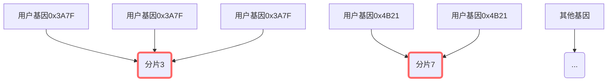
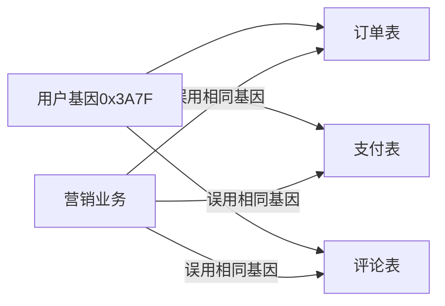
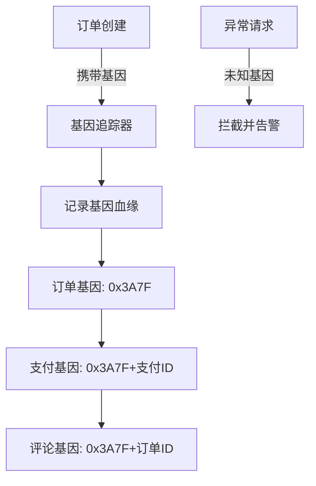

## 分库分表场景下JOIN 挑战

### 场景一：JOIN 部分同库数据（分片表 JOIN）

```sql
-- 示例：订单表 JOIN 店铺表（都是分片表）
SELECT o.order_id, s.shop_name 
FROM tbl_order o 
JOIN tbl_shop s ON o.shop_id = s.shop_id
WHERE o.order_id = 10086;
```


#### 执行过程：
根据 order_id=10086 定位到具体分片（假设在 slice-1）,在 slice-1 本地完成 JOIN 操作,直接返回结果

#### 核心特征：
✅ 数据局部性：关联数据在同一物理分片
✅ 零网络开销：不跨分片通信
✅ 高性能：毫秒级响应
✅ 自动路由：由分片键（如 order_id）决定位置


### 场景二：JOIN 全量数据（分片表 JOIN 全局表）
```sql
-- 示例：订单表 JOIN 用户表（用户表是全局表）
SELECT o.order_id, u.user_name 
FROM tbl_order o 
JOIN tbl_user u ON o.user_id = u.user_id 
WHERE o.order_id = 10086;
```

#### 执行过程：
根据 order_id=10086 定位到 slice-1,在 slice-1 本地访问完整的用户表副本,直接完成 JOIN 操作。返回结果

#### 核心特征：
✅ 数据冗余：全局表在每个分片有全量副本
✅ 本地化 JOIN：避免跨分片查询
✅ 强一致性：通过同步机制保证数据一致
❌ 写放大：更新用户数据需同步所有分片


## 解决方案：全局表的替代方案

当全局表过大时（如 > 1 亿行），可采用：

### 方案 1：ER 关系绑定（父子表）
```xml
# MyCat 配置
<tables>
  <table name="tbl_user" dataNode="dn0,dn1" rule="mod-user-id" />
  <table name="tbl_order" dataNode="dn0,dn1" rule="mod-user-id">
    <childTable joinKey="user_id" parentKey="user_id" />
  </table>
</tables>
```
效果：相同 user_id 的订单和用户数据永远同库

### 方案 2：基因分片法（基因写入分片键）
```sql
ALTER TABLE tbl_order ADD shard_key INT AS (user_id % 1024);
-- 分片规则按 shard_key 分片
原理：相同用户的订单自动路由到同一分片
```


## 基因分片法：保证关联数据同分片的核心原理

### 分片键设计

- 用户表分片键：直接使用用户ID
- 订单表分片键：用户ID + 订单ID 的基因组合


### 具体示例

> 表结构示例

```sql
-- 用户表（基因来源）
CREATE TABLE users (
    user_id BIGINT PRIMARY KEY,  -- 分片键
    name VARCHAR(50)
) COMMENT '分片基因来源表';

-- 订单表（携带基因）
CREATE TABLE orders (
    order_id BIGINT,
    user_id BIGINT,
    shard_key BIGINT AS (
        (user_id & 0xFFFF) << 32 | (order_id & 0xFFFFFFFF)
    ) STORED PRIMARY KEY  -- 基因分片键
);
```

> 基因计算示例
```python

# 基因计算示例（Python伪代码）
def get_shard_key(user_id, order_id):
    # 提取用户ID的基因片段（后16位）
    user_gene = user_id & 0xFFFF  
    
    # 组合成分片键
    return (user_gene << 32) | (order_id & 0xFFFFFFFF)
```

### 业务保障

> 基因冻结:用户注册时确定终身基因,用户ID后16位作为永久基因
> 基因映射:业务ID与用户基因绑定,订单ID携带用户基因
> 基因继承:子资源继承父资源基因	订单商品继承订单基因

### 局限解决

#### 热点问题：基因分布不均导致流量倾斜


> 解决方案：动态基因扰动算法

```python
def dynamic_gene(user_id, salt):
    base_gene = user_id & 0xFFFF  # 基础基因
    
    # 添加动态扰动因子（每小时变化）
    hour_salt = int(time.time() // 3600) % 256
    dynamic_salt = (salt ^ hour_salt) & 0xFF
    
    # 组合最终基因
    return (base_gene ^ dynamic_salt) & 0xFFFF
```


#### 基因冲突：不同业务共享相同基因导致污染

> 问题场景



> 解决方案1：基因命名空间隔离

```java
// 基因类型注册表
public enum GeneNamespace {
    USER(0x01),
    ORDER(0x02),
    PAYMENT(0x03),
    MARKETING(0x80);
    
    private final byte prefix;
    
    public long generateKey(long baseId) {
        return ((long)prefix << 56) | (baseId & 0x00FFFFFFFFFFFFFFL);
    }
}
```

> 解决方案2：基因染色机制

```python
def color_gene(base_gene, business_type):
    # 业务类型染色码
    color_map = {
        'order': 0xA5,
        'payment': 0xB2,
        'comment': 0xC7
    }
    color = color_map.get(business_type, 0xFF)
    
    # 染色后基因 = 基础基因 XOR 染色码
    return (base_gene ^ color) & 0xFFFF

```

> 解决方案3：基因访问控制

```sql
-- 基因访问策略表
CREATE TABLE gene_access_policy (
    gene_prefix BIGINT PRIMARY KEY,
    allowed_tables TEXT[] NOT NULL
);

-- 示例策略
INSERT INTO gene_access_policy VALUES 
(0x3A7F0000, ARRAY['orders', 'payments']),
(0x4B210000, ARRAY['comments']);
```

> 解决方案3：基因血缘追踪

#### 扩容迁移:

> 问题场景

```
graph LR
    subgraph 扩容前
    S0[分片0] -->|基因范围| R0[0x0000-0x3FFF]
    S1[分片1] -->|基因范围| R1[0x4000-0x7FFF]
    end
    
    subgraph 扩容后
    NS0[新分片0] -->|新范围| NR0[0x0000-0x2AAA]
    NS1[新分片1] -->|新范围| NR1[0x2AAB-0x5555]
    NS2[新分片2] -->|新范围| NR2[0x5556-0x7FFF]
    end
    
    R0 -->|需迁移| NR0
    R0 -->|需迁移| NR1
    R1 -->|需迁移| NR1
    R1 -->|需迁移| NR2
```

> 解决方案1:基因范围预分配算法

```java
// 基因范围分配器
public class GeneRangeAllocator {
    private final NavigableMap<Integer, Integer> rangeMap = new TreeMap<>();
    
    public void initRanges(int shardCount) {
        int step = 65536 / shardCount;
        for (int i = 0; i < shardCount; i++) {
            int start = i * step;
            int end = (i == shardCount-1) ? 65535 : (i+1)*step - 1;
            rangeMap.put(start, i);
        }
    }
    
    // 扩容时重新分配
    public void expand(int newShardCount) {
        // 创建新范围映射
        Map<Integer, Integer> newRanges = new HashMap<>();
        
        // 平滑迁移算法...
    }
}

```
> 解决方案2:双基因路由过渡

```java
graph LR
    A[客户端请求] --> B{路由决策}
    B -->|旧基因范围| C[旧分片]
    B -->|新基因范围| D[新分片]
    
    subgraph 迁移过程
    E[数据迁移服务] --> F[旧分片读取]
    F --> G[新分片写入]
    end
    
    H[路由配置中心] -->|动态更新| B
```


