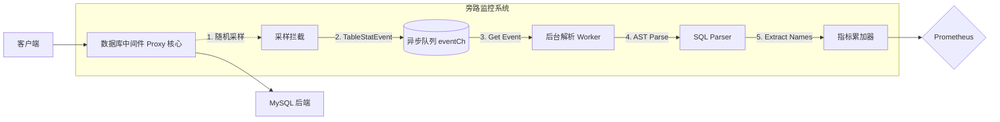

# 数据库中间件：高性能库表级流量监控设计与实践

> **摘要**：在高性能数据库中间件（Proxy）中，实现库表级别的精确流量监控是一项极具挑战性的任务。本文将深入探讨 中间件 如何通过“异步采样 + AST 特征提取”模式，在保持 10w+ QPS 处理能力的同时，提供精准的库表级监控。

---

## 1. 背景与挑战 (The Why)

作为小米开源的 MySQL 数据库中间件Gaea，数据库中间件 承载了海量的核心业务。传统的监控通常停留在“实例”或“Namespace”维度。然而，在以下场景中，我们需要更细粒度的库表指标：
- **热点定位**：某个逻辑库故障时，快速识别是哪张表流量突增。
- **慢查询回溯**：分析特定表的 QPS 趋势与响应时间关联。
- **容量规划**：根据库表的增长趋势进行分库分表决策。

**核心挑战**：提取表名需要对 SQL 进行完整的 **抽象语法树（AST）解析**，这比正则表达式或 Token 扫描开销大数倍。在高并发链路上全量解析会显著推高响应延迟（Latency Penalty）。

---

## 2. 核心架构设计 (Architecture)

数据库中间件 采用了“主链路解耦、旁路异步解析”的架构设计。

### 2.1 整体流程图

### 2.2 关键实现细节
- **拦截点 (Interception)**：在 `manager.RecordSessionSQLMetrics` 中执行。这是 SQL 执行完成后的监控回放阶段，对业务延时无感知。
- **异步队列 (Queueing)**：命中的 SQL 被包装为 `TableStatEvent` 推入 `eventCh`。采用 `select default` 模式，当队列满时直接丢弃，**保证监控系统绝对不拖累业务系统**。
- **采样判定 (Sampling)**：通过 `TableStatsSampleRate` 配置（如 `1/1000`）平衡性能与精度。

---

## 3. 智能解析逻辑 (Parsing Intelligence)

### 3.1 会话上下文补全
SQL 解析器必须处理多种复杂的查询语法：
1. **显式指定库名**：`SELECT * FROM db_sales.order_it;` -> 解析器直接提取 `db_sales`。
2. **隐式依赖上下文**：`SELECT * FROM order_it;` -> 解析器提取库名为空，通过 `TableStatsManager` 自动使用会话当前的 `USE database` 状态（Context Completion）进行补全。

### 3.2 性能优化：大小写归一化
在 MySQL 中，数据库名和表名的大小写敏感性取决于底层文件系统及配置。数据库中间件 在提取后会对 Schema 和 Name 执行 **归一化（Lower Case）** 处理，防止因 SQL 写法不同（如 `SELECT` vs `select`）导致 Prometheus Label 爆炸。

---

## 4. 指标治理与内存防护 (Metric Management)

库表级指标面临的最大技术挑战是 **维度基数爆炸 (Cardinality Explosion)**。如果一个集群有数万张表，监控指标将占用极大内存。

### 4.1 指标结构
| Label | 说明 |
| :--- | :--- |
| `Cluster` | 逻辑集群标识 |
| `Namespace` | 业务单元/租户 |
| `Db` | 规范化后的逻辑库名 |
| `Table` | 规范化后的逻辑表名 |

### 4.2 OOM 防护措施
- **热更新动态回收**：当配置 `TableStatsEnabled` 从 `true` 切换为 `false` 时，数据库中间件 会立即执行 `Reset()`，彻底释放内存中的指标句柄。
- **Admin 强制刷新**：通过 Admin 接口支持手动清理不活跃的指标缓存。

---

## 5. 采样模型 FAQ (Statistical FAQ)

### Q: 为什么必须采样而非全量？
**A: 性能隔离。**
AST 解析是昂贵的 CPU 操作。以 1/1000 采样率为例，99.9% 的流量仅需数微秒完成基础处理，只有 0.1% 进入解析协程。这确保了 Proxy 的吞吐能力。

### Q: 采样会遗漏业务数据吗？
**A: 统计学意义大于绝对数值。**
对于高频的热点表，根据 **大数定律 (Law of Large Numbers)**，采样后的估算值非常接近真实波动。对于低频“长尾表”，虽然可能偶尔遗漏在看板上，但这些表通常不是系统性能瓶颈所在。

### Q: 监控 vs. 审计
| 特性 | 库表流量监控 (Table Stats) | 审计日志 (Audit Log) |
| :--- | :--- | :--- |
| **设计目标** | 趋势分析、负载判定 | 合规追溯、行为审查 |
| **数据模型** | 聚合指标 (Prometheus) | 原始记录 (Logger/Kafka) |
| **性能损耗** | **微乎其微** | 较高（需磁盘/网络 I/O） |

---

## 6. 运维实践建议 (Best Practices)

1. **默认设置建议**：建议生产环境采样率设为 `1000` 或 `2000`。
2. **排障临时全量**：在进行短暂的压测分析或排故时，可通过 Admin 接口动态将采样率调至 `1` 以获取 100% 的准确统计。
3. **监控报警**：关注 `数据库中间件_table_traffic_total` 指标的 `rate()`，相比具体数值，**斜率的变化**对识别系统抖动更有价值。

---

> [!NOTE]
> 设计者按：本方案的核心原则是 **"Utility over Integrity"** —— 在 Proxy 场景下，监控的首要任务是“观测健康”而非“记录细节”，这一架构选择为 数据库中间件 的高性能提供了有力支撑。

## 7. 进阶思考：应对“大基数陷阱”的工程挑战 (Advanced Engineering)

虽然当前版本通过“异步采样 + 指标重置”已经能覆盖绝大多数业务场景，但面对拥有百万级物理表的超大规模集群时，如何更优雅地处理 **大基数 (High Cardinality)** 问题？以下是后续演进的几个技术方向：

### 7.1 Top-K 统计算法与 Count-Min Sketch

在海量库表的环境中，99% 的流量往往集中在 1% 的热点表上。

- **Count-Min Sketch**：一种概率性数据结构。它允许我们在极小的固定内存（Fix-sized Memory）空间内，以可控的误差率估算数亿个 Key 的访问频率。
- **Top-K 识别**：配合 **Heavy Keepers** 算法或 **Stream-Summary**，我们可以只针对 Top 1000 的高频表名暴露 Prometheus 指标，而将“长尾”的小流量表合并为一个 `others` 维度。这能将内存占用维持在常量级别。

### 7.2 LRU Cache 与动态淘汰

为了防止内存中堆积过期的“僵尸”指标（例如已经删掉的临时表），可以引入基于 **LRU (Least Recently Used)** 思想的清理机制：

- **存活判定**：为每个库表指标记录最后一次访问的时间戳。
- **定时淘汰 (Eviction)**：后台任务定期扫描，将超过 $N$ 分钟未更新的指标从内存中彻底卸载。

### 7.3 指标衰减 (Decay Factor)

在计算 QPS 时，如果希望更加关注“即时热度”，可以引入 **指数衰减 (Exponential Decay)** 因子。这在识别突发流量（Flash Crowds）时比简单的滑动平均窗口更具灵敏度。

---

> [!NOTE]
> 设计者按：本方案的核心原则是 **"Utility over Integrity"** —— 在 Proxy 场景下，监控的首要任务是“观测健康”而非“记录细节”，这一架构选择为 数据库中间件 的高性能提供了有力支撑。
