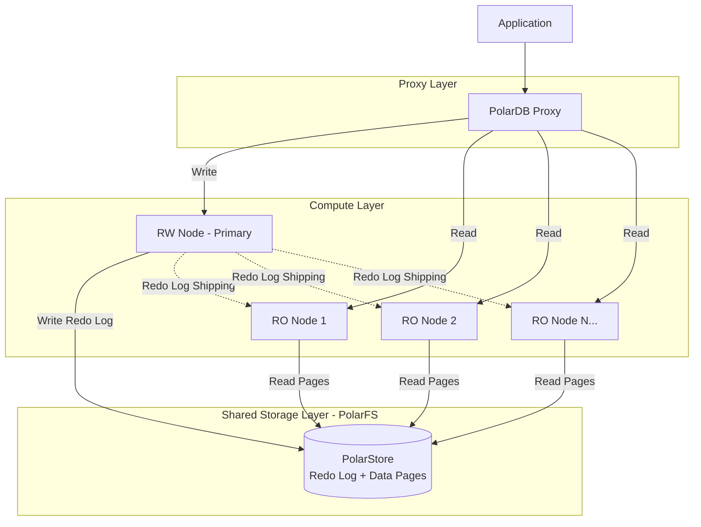
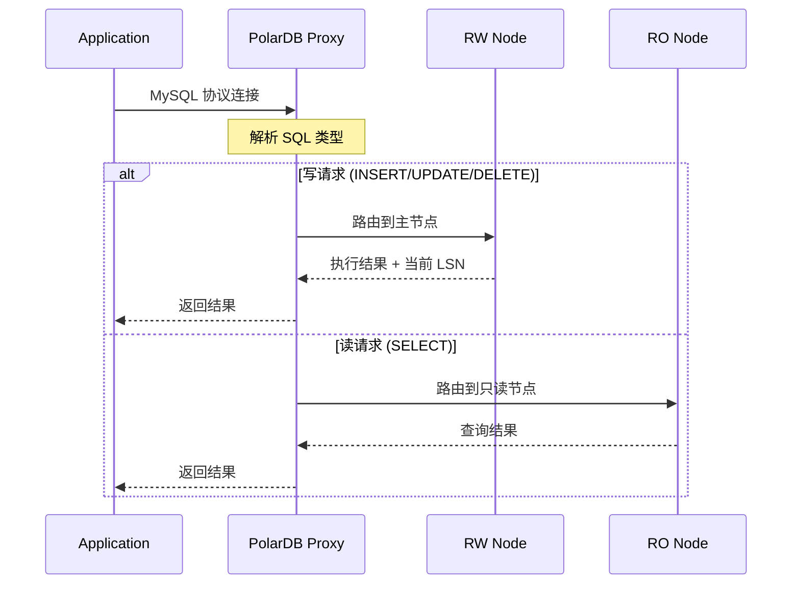
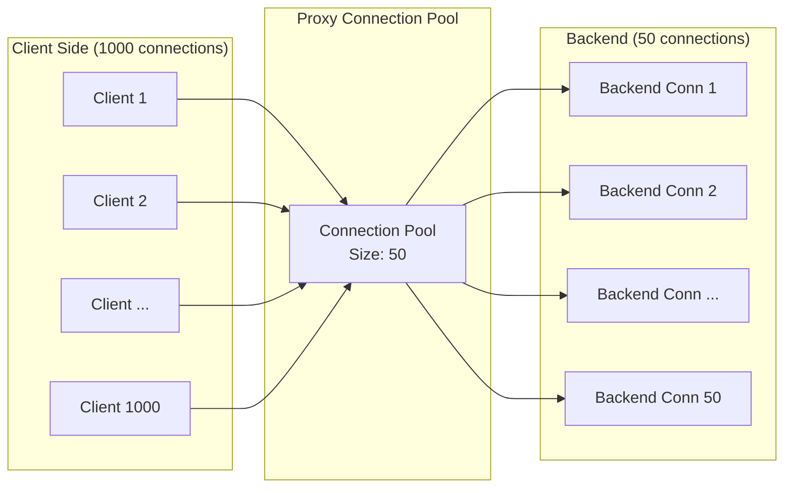
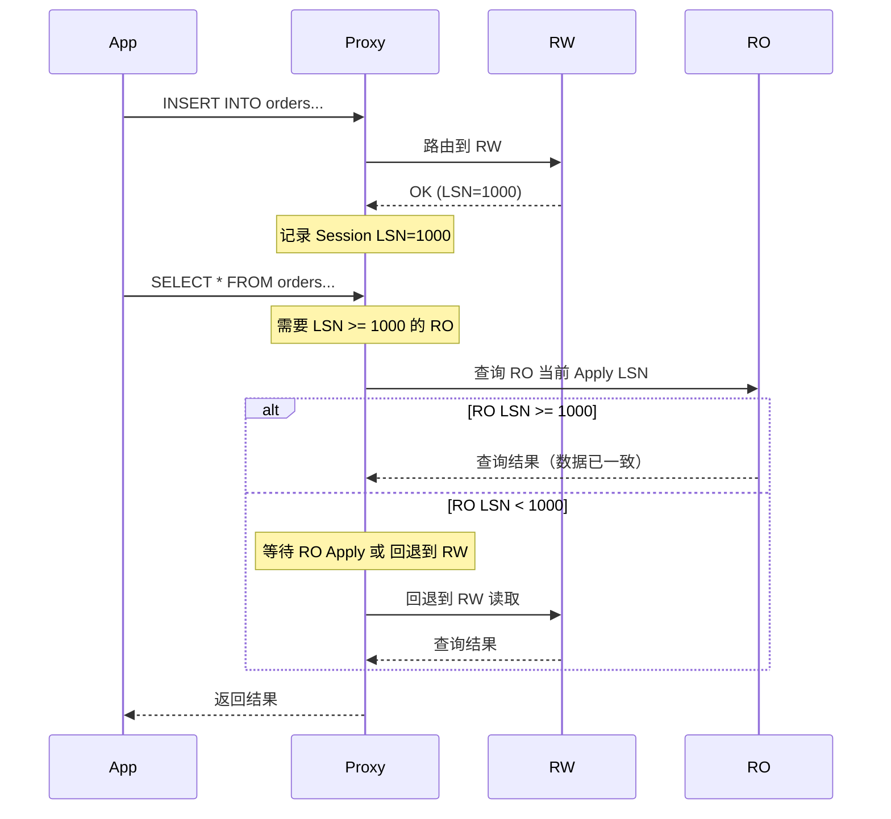

# PolarDB Proxy 设计：计算存储分离与代理层架构深度拆解

> **摘要**：PolarDB 是阿里云自研的云原生关系型数据库，其核心创新在于计算存储分离架构与高性能 Proxy 代理层。本文将从架构动机、存储引擎、代理层设计三个维度进行深度拆解，揭示云原生数据库 Proxy 的核心设计思想。

---

## 1. 背景与动机

### 1.1 传统架构的瓶颈

传统 MySQL 采用 **Shared-Nothing** 架构——每个实例独立拥有自己的计算和存储资源。这种设计在单机时代运行良好，但在云环境中暴露出严重问题：

| 痛点 | 具体表现 |
|------|---------|
| **扩容慢** | 添加只读副本需要完整数据拷贝，TB 级别可能需要数小时 |
| **存储浪费** | 每个副本持有全量数据副本，3 副本 = 3 倍存储成本 |
| **故障恢复慢** | 主节点故障后，从节点需要应用大量 Binlog 才能追上 |
| **弹性差** | 无法独立扩展计算或存储，只能整体 Scale-up |

而 **Shared-Everything**（如传统 Oracle RAC）虽然解决了存储共享问题，但其对共享内存和高速互联网络的强依赖使其难以适配云环境的弹性需求。

### 1.2 云原生数据库的核心需求

云原生场景对数据库提出了全新要求：

- **秒级弹性**：计算节点可快速添加/移除，无需数据迁移
- **按量计费**：存储和计算独立计费，用多少付多少
- **高可用**：故障恢复时间 < 30s，对业务无感知
- **透明接入**：对应用层完全兼容 MySQL 协议，零改造

### 1.3 PolarDB 的定位

PolarDB 采用了 **Shared-Storage** 架构——计算节点共享同一份物理存储，结合高性能 Proxy 层对外提供统一入口。这是在 Shared-Nothing 和 Shared-Everything 之间找到的最佳平衡点。

---

## 2. 计算存储分离架构

### 2.1 核心架构图



### 2.2 共享存储层：PolarFS

PolarFS 是 PolarDB 的分布式文件系统底座，其设计目标是在分布式环境中提供接近本地 SSD 的 I/O 性能。

**核心技术栈：**

- **RDMA 网络**：通过 Remote Direct Memory Access 绕过内核网络协议栈，端到端延迟 < 10μs
- **SPDK 用户态 I/O**：通过 Storage Performance Development Kit 绕过内核块设备层，直接操作 NVMe SSD
- **ParallelRaft 一致性协议**：改进的 Raft 协议，允许乱序确认（Out-of-Order Commit），提升写入吞吐

```
传统路径：App → Kernel VFS → Block Layer → Device Driver → SSD
PolarFS 路径：App → PolarFS (User Space) → SPDK → NVMe SSD (RDMA Network)
```

通过"去内核化"设计，PolarFS 将单次 I/O 延迟从 ~100μs 降低到 ~10μs 级别。

### 2.3 Redo Log 物理复制 vs Binlog 逻辑复制

这是 PolarDB 与传统 MySQL 主从复制最根本的差异之一。

| 维度 | MySQL Binlog（逻辑复制） | PolarDB Redo Log（物理复制） |
|------|--------------------------|------------------------------|
| **复制内容** | SQL 语句或行变更事件 | 物理页面变更（Page-level delta） |
| **解析成本** | 需要 SQL 解析 + 执行 | 直接 Apply 到物理页面，无需 SQL 层 |
| **复制延迟** | 较高（需经过 SQL 层） | 极低（直接修改页面） |
| **数据一致性** | 可能存在非确定性函数问题 | 物理精确复制，100% 一致 |
| **副本用途** | 独立实例，各自存储 | 共享存储，只需 Apply Redo 到 Buffer Pool |

**为什么选择 Redo Log？** 因为计算存储分离架构下，所有节点共享同一份物理存储。RO 节点不需要写入数据页到磁盘——它只需要将 RW 节点产生的 Redo Log Apply 到自己的 Buffer Pool 中，保证内存中的数据页是最新版本即可。

### 2.4 Buffer Pool 一致性问题

由于所有节点共享存储，核心挑战在于：**RO 节点的 Buffer Pool 中缓存的页面可能已经被 RW 节点修改了**。

PolarDB 的解决方案是 **全局页面版本号（Page Version / LSN）机制**：

```
RW 节点写入流程：
1. 修改 Buffer Pool 中的 Page
2. 生成 Redo Log (携带 LSN)
3. Redo Log 写入 PolarFS（持久化）
4. 异步将 Redo Log 发送给所有 RO 节点

RO 节点接收流程：
1. 接收 Redo Log
2. 检查本地 Buffer Pool 中是否缓存了对应 Page
3. 如果缓存了 → Apply Redo 更新该 Page
4. 如果未缓存 → 标记为 Invalid，下次访问时从存储读取最新版本
```

**关键设计：Future Page 机制**

当 RO 节点收到一个读请求，但该页面的 Redo Log 尚未 Apply 完成时，PolarDB 不会返回过时数据，而是等待对应 LSN 的 Redo Log Apply 完成后再返回——这就是 **Future Page** 语义，保证了 RO 节点的一致性读。

### 2.5 计算存储分离的收益

1. **秒级加只读节点**：新 RO 节点只需挂载共享存储 + 加载 Buffer Pool，无需数据拷贝
2. **存储独立扩容**：存储层按需扩展，计算层无感知
3. **故障域隔离**：计算节点故障不影响存储；存储通过多副本保障数据安全
4. **成本优化**：N 个计算节点共享 1 份存储，相比传统 N 副本节省 (N-1)/N 的存储成本

---

## 3. PolarDB Proxy 代理层设计

### 3.1 Proxy 在架构中的位置

PolarDB Proxy 处于客户端与数据库计算节点之间，是整个系统的**流量入口**和**智能路由层**。



对应用而言，Proxy 就是一个 MySQL 实例——完全兼容 MySQL 协议，应用无需任何改造。

### 3.2 核心能力拆解

#### 3.2.1 读写分离

Proxy 根据 SQL 类型自动决定路由方向：

```
路由决策伪代码：
func route(sql string, session Session) Target {
    // 1. 事务内所有请求 → RW
    if session.inTransaction() {
        return RW
    }
    
    // 2. 显式 Hint → 按 Hint 路由
    if sql.hasHint("FORCE_MASTER") {
        return RW
    }
    if sql.hasHint("FORCE_SLAVE") {
        return RO
    }
    
    // 3. 写操作 → RW
    if sql.isWrite() {  // INSERT, UPDATE, DELETE, DDL
        return RW
    }
    
    // 4. 特殊读操作 → RW
    if sql.isSelectForUpdate() || sql.isLockInShareMode() {
        return RW
    }
    
    // 5. 普通 SELECT → RO (负载均衡选择)
    return loadBalancer.selectRO()
}
```

#### 3.2.2 连接池复用

传统模式下，每个客户端连接对应一个后端连接（1:1 映射），后端连接数随客户端线性增长。PolarDB Proxy 提供**连接池模式**：



**核心挑战：连接状态同步**

当连接被复用时，每个客户端 Session 可能设置了不同的变量（如 `SET NAMES utf8mb4`、`SET autocommit=0`）。Proxy 需要在将连接借出时，同步这些 Session 变量到后端连接：

```
连接借出流程：
1. 从 Pool 获取空闲 Backend Connection
2. 对比 Client Session 状态 vs Backend Connection 状态
3. 差异部分通过 SET 语句同步（change_user / reset_connection）
4. 执行实际 SQL
5. SQL 完成后，清理状态 → 归还 Pool
```

Prepared Statement 是连接池模式下的另一个难点：`PREPARE` 操作绑定了特定后端连接，复用时需要在新连接上重新 `PREPARE`。

#### 3.2.3 负载均衡策略

| 策略 | 适用场景 | 实现原理 |
|------|---------|---------|
| **轮询（Round Robin）** | 通用场景 | 按序分配到各 RO 节点 |
| **权重（Weighted）** | 异构节点 | 高配节点分配更多流量 |
| **最小连接数（Least Connections）** | 长查询混合 | 优先选择活跃连接数最少的节点 |
| **一致性读路由** | 写后读一致 | 根据 LSN 选择已追上的 RO 节点 |

#### 3.2.4 会话一致性保证（Session Consistency）

读写分离最大的问题是**写后读不一致**：写入 RW 节点后，立即从 RO 节点读取可能读到旧数据（因为 Redo Log 尚未 Apply）。

PolarDB Proxy 通过 **LSN 追踪** 实现因果一致性：



核心流程：

1. 每次写操作完成后，Proxy 记录 RW 返回的当前 LSN
2. 后续该 Session 的读请求，Proxy 检查目标 RO 节点的 Apply LSN
3. 如果 RO 已追上 → 路由到 RO
4. 如果 RO 未追上 → 等待短暂时间或回退到 RW 读取

### 3.3 拓扑感知与故障切换

**拓扑感知**：Proxy 需要实时感知后端节点的状态变化（节点上线/下线、角色切换）。PolarDB Proxy 通过与 **PolarCtrl**（集群控制面）的交互实现：

- PolarCtrl 通过心跳监测所有节点健康状态
- 拓扑变更时，PolarCtrl 推送事件给 Proxy
- Proxy 更新内部路由表，新请求自动路由到新拓扑

**HA 切换期间的处理**：

```
RW 故障切换流程：
1. PolarCtrl 检测到 RW 节点故障
2. 选举新 RW（从某个 RO 提升）
3. 通知 Proxy 更新路由：旧 RW → 新 RW
4. Proxy 行为：
   - 进行中的写事务：返回错误，由应用重试
   - 新的写请求：路由到新 RW
   - 读请求：不受影响，继续路由到其他 RO
5. 整体切换时间 < 30s
```

---

## 4. 关键设计细节

### 4.1 事务路由策略

**铁律：事务内的所有请求必须路由到同一个 RW 节点。**

```
BEGIN;                      → RW (开始事务)
SELECT * FROM users;        → RW (事务内读，不走 RO)
UPDATE users SET age=30;    → RW
COMMIT;                     → RW (提交事务)
```

Proxy 通过跟踪 `autocommit` 状态和显式 `BEGIN/START TRANSACTION` 来判断事务边界。隐式事务（`autocommit=0` 模式）需要特别注意——每条 SQL 都自动开启事务。

### 4.2 Hint 路由机制

当自动路由无法满足需求时，应用可以通过 SQL Hint 强制指定路由方向：

```sql
/* FORCE_MASTER */ SELECT * FROM orders WHERE id = 123;
-- 强制路由到 RW 节点，用于需要最新数据的场景

/* FORCE_SLAVE */ SELECT count(*) FROM logs;
-- 强制路由到 RO 节点，用于明确可以读旧数据的场景
```

### 4.3 大查询限流与超时控制

针对分析型大查询可能拖垮 RO 节点的问题，Proxy 提供：

- **慢查询熔断**：执行时间超过阈值的查询被主动 Kill
- **并发限流**：限制单个 RO 节点的并发大查询数量
- **资源隔离**：将 OLTP 短查询和 OLAP 长查询路由到不同 RO 节点

---

## 5. 与同类产品的对比

| 特性 | PolarDB Proxy | ProxySQL | MySQL Router | MaxScale |
|------|--------------|----------|-------------|----------|
| **定位** | 云原生数据库内建 | 通用 MySQL Proxy | MySQL 官方轻量 Proxy | MariaDB 企业级 Proxy |
| **读写分离** | 内建，LSN 一致性 | 规则引擎配置 | 基础支持 | ReadWriteSplit Router |
| **连接池** | 内建，状态同步 | 连接复用 | 无内建 | 连接池模式 |
| **一致性保证** | LSN 级别因果一致 | 无内建 | 无内建 | GTID 因果读 |
| **计算存储分离感知** | 深度集成 | 无 | 无 | 无 |
| **故障切换** | PolarCtrl 联动 | 自检 + 切换 | Group Replication 联动 | Monitor 模块 |
| **部署模式** | 云服务内建 | 独立部署 | Sidecar / 独立 | 独立部署 |

PolarDB Proxy 最大的独特优势在于：它不是一个通用代理，而是**与计算存储分离架构深度耦合**的专用代理层。LSN 感知、拓扑推送、Buffer Pool 一致性保证——这些都是通用 Proxy 无法实现的能力。

---

## 6. 总结与启发

### 6.1 核心结论

1. **计算存储分离是云原生数据库的基石**：它解锁了秒级弹性、成本优化、故障域隔离等关键能力
2. **Redo Log 物理复制 > Binlog 逻辑复制**：在共享存储架构下，物理复制的延迟和一致性优势是决定性的
3. **Proxy 是用户体验的关键**：对应用无侵入，读写分离 + 连接池 + 一致性保证，这些都在 Proxy 层透明完成

### 6.2 对中间件工程师的启示

- **连接池状态同步**是一个被严重低估的工程难题——变量同步、Prepared Statement 迁移、字符集切换，每个细节都可能引发 Bug
- **一致性读路由**是读写分离的灵魂——没有 LSN/GTID 追踪的读写分离，在生产环境中几乎不可用
- **Proxy 应与后端架构深度耦合**——通用 Proxy 只能做到"够用"，与存储引擎深度集成的 Proxy 才能提供极致体验

---

> **参考资料**：
>
> - PolarDB 官方文档：<https://www.alibabacloud.com/help/polardb>
> - 《PolarFS: An Ultra-low Latency and Failure Resilient Distributed File System》— VLDB 2018
> - 《PolarDB Serverless: A Cloud Native Database for Disaggregated Data Centers》— SIGMOD 2021
