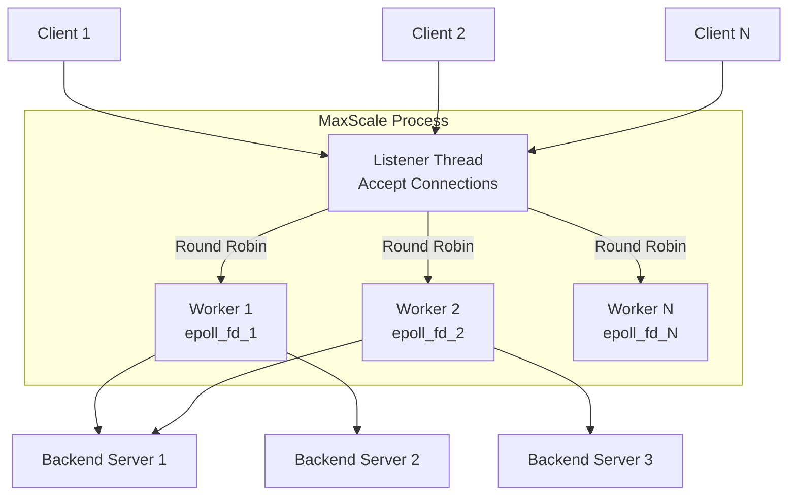
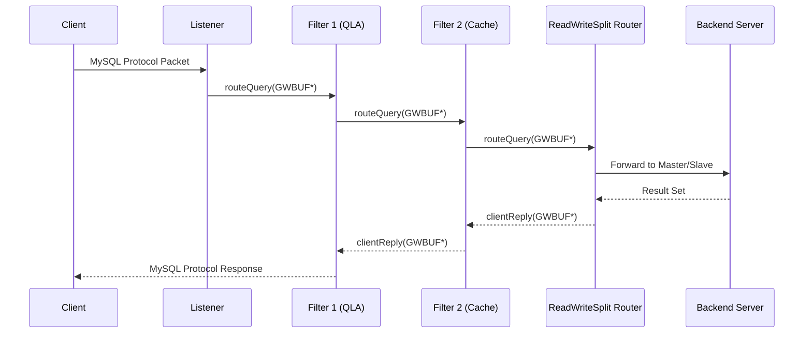
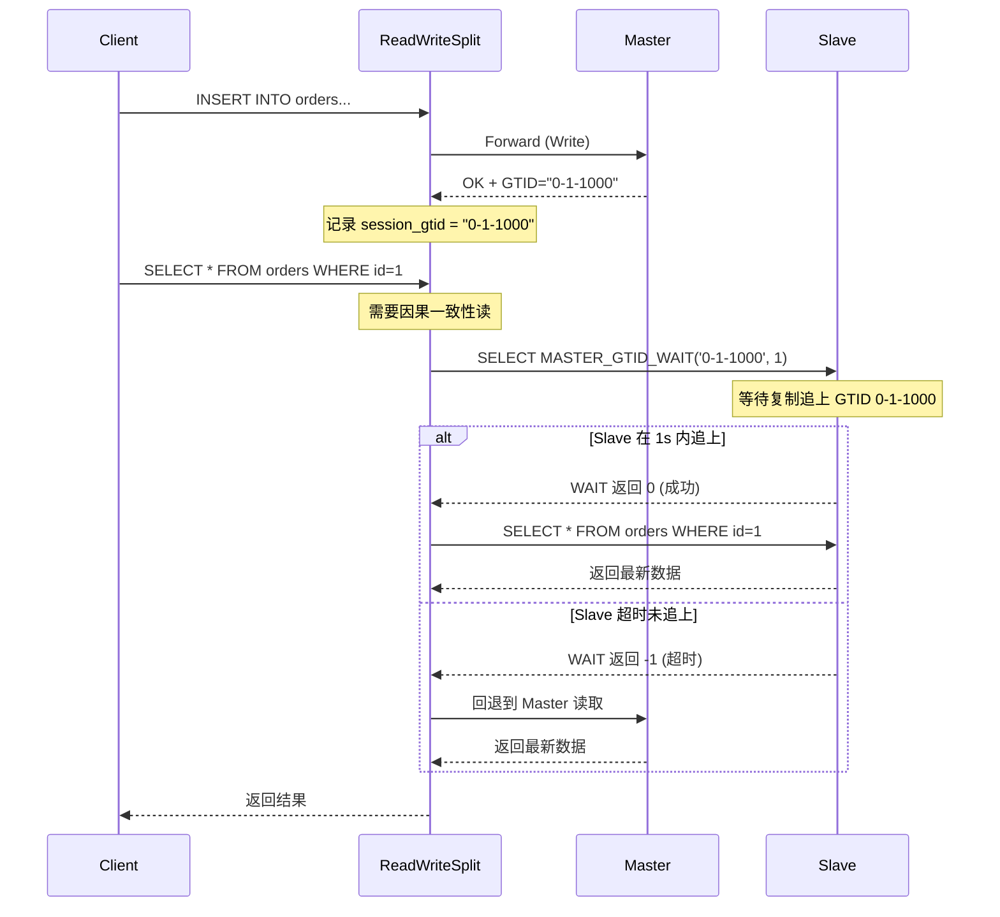
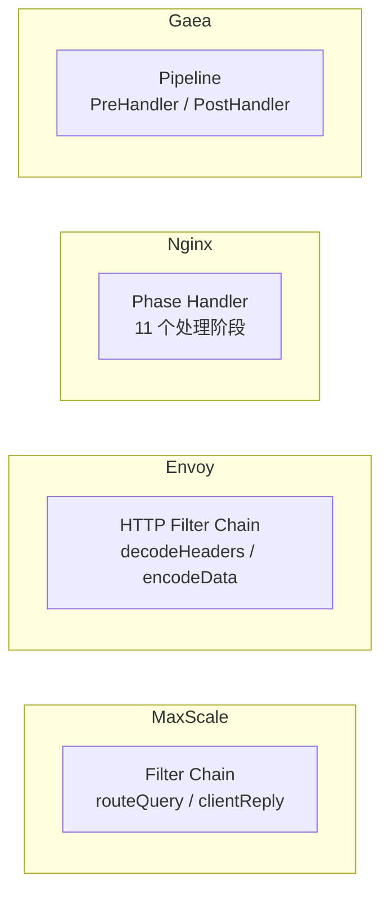

# MaxScale 源码剖析：读写分离 Filter 链设计与实现

> **摘要**：MaxScale 是 MariaDB 官方开源的数据库代理中间件，其最核心的设计思想是 **Filter Chain（过滤器链）** 模式——通过可组合、可插拔的 Filter 对请求和响应进行链式处理。本文将从源码层面深入分析 MaxScale 的 Filter Chain 架构、ReadWriteSplit Router 的路由决策机制，以及因果一致性读的实现细节。

---

## 1. MaxScale 概述与架构

### 1.1 定位

MaxScale 在 MariaDB 生态中的角色是 **Database Proxy / Gateway**——位于应用与数据库之间，提供读写分离、负载均衡、查询过滤、故障切换等能力。它不同于简单的连接转发器，而是一个**可编程的请求处理管线（Pipeline）**。

### 1.2 线程模型

MaxScale 采用 **Worker Thread + Epoll** 事件驱动模型：

- 固定数量的 Worker 线程（默认等于 CPU 核心数）
- 每个 Worker 拥有独立的 Epoll 实例
- 客户端连接通过 Round-Robin 分配到 Worker
- 单个连接的所有请求在同一 Worker 线程内处理（无锁）



这种设计保证了**无锁处理**——同一个 Session 的所有操作在同一个线程内完成，避免了并发竞争。

### 1.3 核心抽象概念

MaxScale 的配置和运行时结构由以下核心对象组成：

```
Service          — 一个逻辑服务，定义了"用什么 Router + 哪些 Filter + 连接哪些 Backend"
  ├── Listener   — 监听端口，接收客户端连接
  ├── Router     — 路由模块（如 ReadWriteSplit），决定请求发往哪个 Backend
  ├── Filter[]   — 过滤器链，对请求/响应进行拦截处理
  └── Server[]   — 后端数据库服务器列表
```

配置示例：

```ini
[Read-Write-Service]
type=service
router=readwritesplit
servers=server1,server2,server3
filters=QLA|MyCustomFilter

[Read-Write-Listener]
type=listener
service=Read-Write-Service
protocol=MariaDBClient
port=3306
```

### 1.4 请求生命周期



关键点：**请求和响应走的是同一条 Filter Chain，但方向相反**——请求方向调用 `routeQuery`，响应方向调用 `clientReply`。

---

## 2. Filter 链（Filter Chain）架构

### 2.1 设计哲学

Filter Chain 的设计灵感来源于经典的 **责任链模式（Chain of Responsibility）**，类似于：

- Java Servlet 的 `FilterChain`
- Netty 的 `ChannelPipeline` / `ChannelHandler`
- Nginx 的 Phase Handler

核心思想：**每个 Filter 只关注自己的职责，通过链式调用将请求传递给下一个 Filter**。Filter 可以：

- 拦截并修改请求（如 SQL 改写）
- 拦截并修改响应（如结果缓存）
- 记录信息但不修改（如审计日志）
- 终止链路并直接返回（如缓存命中）

### 2.2 Filter 接口定义

在 MaxScale 的 C/C++ 源码中，Filter 模块需要实现以下核心接口：

```cpp
// 源码路径: include/maxscale/filter.hh

class FilterSession : public MXS_FILTER_SESSION {
public:
    // 处理从客户端发来的请求（请求方向）
    // 返回 1 表示继续传递，0 表示终止
    virtual int routeQuery(GWBUF* buffer) = 0;
    
    // 处理从后端返回的响应（响应方向）
    virtual int clientReply(GWBUF* buffer,
                           const mxs::ReplyRoute& down,
                           const mxs::Reply& reply) = 0;
    
    // 诊断信息输出
    virtual json_t* diagnostics() const;
};

class Filter : public MXS_FILTER {
public:
    // 创建 Filter 实例（进程级别，全局唯一）
    static Filter* create(const char* name, mxs::ConfigParameters* params);
    
    // 为每个客户端会话创建 FilterSession
    virtual FilterSession* newSession(MXS_SESSION* session,
                                      SERVICE* service) = 0;
};
```

每个回调函数的调用时机：

| 回调函数 | 调用时机 | 典型用途 |
|---------|---------|---------|
| `create` | MaxScale 启动加载配置时 | 初始化全局资源（如缓存池） |
| `newSession` | 客户端建立连接时 | 初始化 Session 级状态 |
| `routeQuery` | 每个请求到达时 | SQL 改写、审计、限流 |
| `clientReply` | 每个响应返回时 | 结果缓存、响应改写 |
| `closeSession` | 客户端断开连接时 | 清理 Session 资源 |

### 2.3 Filter Chain 的组装过程

Filter Chain 在 Service 启动时，根据配置文件中的 `filters=A|B|C` 声明进行组装。源码中的组装逻辑：

```cpp
// 伪代码：Filter Chain 构建过程
// 源码参考: server/core/service.cc

void Service::create_filter_chain() {
    // 配置中 filters=QLA|Cache|Tee
    // 组装顺序：Client → QLA → Cache → Tee → Router
    
    FilterSession* chain_tail = router_session;  // 链尾是 Router
    
    // 从后向前构建链表
    for (int i = filter_count - 1; i >= 0; i--) {
        FilterSession* fs = filters[i]->newSession(session, this);
        fs->set_downstream(chain_tail);   // 设置下游
        chain_tail->set_upstream(fs);     // 设置上游（用于 clientReply）
        chain_tail = fs;
    }
    
    session->set_head(chain_tail);  // 链头 = 第一个 Filter
}
```

### 2.4 双向过滤与 GWBUF

**GWBUF（Gateway Buffer）** 是 MaxScale 中数据传递的基本单元——一个链式缓冲区，类似 Linux 内核的 `sk_buff`：

```cpp
// GWBUF 结构简化表示
struct GWBUF {
    uint8_t* start;     // 数据起始指针
    uint8_t* end;       // 数据结束指针
    GWBUF*   next;      // 链表下一个节点（支持分包）
    uint32_t gwbuf_type; // 缓冲区类型标记
};
```

Filter 之间通过传递 `GWBUF*` 指针来传递数据。Filter 可以：

- **透传**：直接将 `GWBUF*` 传给下游
- **修改**：修改 GWBUF 中的内容（如 SQL 改写）
- **克隆**：`gwbuf_clone()` 复制一份 GWBUF（如 Tee Filter 的流量复制）
- **丢弃**：`gwbuf_free()` 释放 GWBUF（如被缓存命中拦截）

---

## 3. 读写分离的实现：ReadWriteSplit Router

### 3.1 架构说明

ReadWriteSplit（简称 RWSplit）在 MaxScale 中是一个 **Router**（而非 Filter），但它与 Filter Chain 紧密协作——它处于 Filter Chain 的末端，接收经过所有 Filter 处理后的请求。

```
Client → [Filter1] → [Filter2] → ... → [ReadWriteSplit Router] → Backend
                                              ↓
                                    路由决策：Master or Slave?
```

### 3.2 核心源码结构

```
server/modules/routing/readwritesplit/
├── readwritesplit.hh       // RWSplit 类声明（Router 主体）
├── readwritesplit.cc       // Router 生命周期管理
├── rwsplitsession.hh       // RWSplitSession 类声明（每 Session 路由状态）
├── rwsplitsession.cc       // 核心路由逻辑
├── rwsplit_route_stmt.cc   // SQL 路由决策
└── rwsplit_causal_reads.cc // 因果一致性读实现
```

**RWSplitSession** 是核心——它为每个客户端会话维护路由状态：

```cpp
class RWSplitSession : public RouterSession {
    // 当前 Master 连接
    mxs::RWBackend* m_current_master;
    
    // 所有可用的 Slave 连接
    mxs::PRWBackends m_slave_connections;
    
    // 事务状态
    bool m_in_transaction;
    
    // 上一次写操作的 GTID（用于因果读）
    std::string m_gtid;
    
    // 目标选择策略
    select_criteria_t m_criteria;
};
```

### 3.3 SQL 分类与路由决策

路由决策是 RWSplit 的核心逻辑，位于 `rwsplit_route_stmt.cc`：

```cpp
// 路由决策伪代码（基于源码简化）
route_target_t RWSplitSession::get_target(GWBUF* buffer) {
    
    uint32_t type = qc_get_type_mask(buffer);  // SQL 分类
    
    // 1. 事务内 → Master
    if (m_in_transaction) {
        return TARGET_MASTER;
    }
    
    // 2. 写操作 → Master
    if (type & (QUERY_TYPE_WRITE | QUERY_TYPE_CREATE | QUERY_TYPE_DROP)) {
        return TARGET_MASTER;
    }
    
    // 3. SELECT ... FOR UPDATE → Master
    if (type & QUERY_TYPE_WRITE_LOCK) {
        return TARGET_MASTER;
    }
    
    // 4. 检查 Hint
    // -- maxscale route to server server1
    if (buffer_has_hint(buffer, HINT_ROUTE_TO_MASTER)) {
        return TARGET_MASTER;
    }
    if (buffer_has_hint(buffer, HINT_ROUTE_TO_SLAVE)) {
        return TARGET_SLAVE;
    }
    
    // 5. Prepared Statement
    // PREPARE 走 Master（需要状态绑定）
    // EXECUTE 根据 PREPARE 时的 SQL 类型决定
    if (type & QUERY_TYPE_PREPARE_STMT) {
        return TARGET_MASTER;  // 保守策略
    }
    
    // 6. 多语句（Multi-Statement）→ Master
    // 无法逐条判断，保守路由到 Master
    if (type & QUERY_TYPE_MULTI_STATEMENT) {
        return TARGET_MASTER;
    }
    
    // 7. 普通 SELECT → Slave
    if (type & QUERY_TYPE_READ) {
        return TARGET_SLAVE;
    }
    
    // 8. 无法判断 → Master（保守）
    return TARGET_MASTER;
}
```

SQL 分类由 MaxScale 内置的 **Query Classifier（qc）** 完成，底层使用 MariaDB 的 SQL Parser 进行 AST 解析。

### 3.4 Slave 选择与负载均衡

当决定路由到 Slave 后，需要从多个 Slave 中选择一个：

```cpp
mxs::RWBackend* RWSplitSession::get_slave_backend() {
    mxs::RWBackend* best = nullptr;
    
    switch (m_criteria) {
        case LEAST_CURRENT_OPERATIONS:
            // 选择当前活跃查询数最少的 Slave
            for (auto& backend : m_slave_connections) {
                if (!best || backend->current_ops() < best->current_ops()) {
                    best = backend;
                }
            }
            break;
            
        case LEAST_GLOBAL_CONNECTIONS:
            // 选择全局连接数最少的 Slave
            break;
            
        case ADAPTIVE_ROUTING:
            // 基于平均响应时间选择最快的 Slave
            break;
    }
    
    return best;
}
```

---

## 4. 因果一致性读（Causal Reads）实现

### 4.1 问题描述

读写分离的经典问题：**Write-then-Read Inconsistency**。

```
Time T1: INSERT INTO orders (id, status) VALUES (1, 'paid');   → Master
Time T2: SELECT status FROM orders WHERE id = 1;                → Slave
         结果可能是 NULL（复制延迟导致 Slave 尚未收到该行）
```

### 4.2 MaxScale 的解决方案：基于 GTID 的因果一致性

MaxScale 2.3+ 引入了 `causal_reads` 配置项，实现流程如下：



### 4.3 源码级分析

核心实现位于 `rwsplit_causal_reads.cc`：

```cpp
// 因果读处理伪代码
bool RWSplitSession::handle_causal_read(GWBUF* buffer) {
    if (!m_config.causal_reads || m_gtid.empty()) {
        return false;  // 未启用因果读 或 无写操作记录
    }
    
    // 在实际查询前，先发送 GTID WAIT 命令
    std::string wait_query = 
        "SELECT MASTER_GTID_WAIT('" + m_gtid + "', " 
        + std::to_string(m_config.causal_reads_timeout) + ")";
    
    GWBUF* wait_buf = modutil_create_query(wait_query.c_str());
    
    // 发送 WAIT 查询到目标 Slave
    m_target_slave->write(wait_buf);
    
    // 保存原始查询，等 WAIT 返回后再发送
    m_pending_query = buffer;
    m_state = WAITING_FOR_GTID;
    
    return true;
}

// WAIT 返回后的回调处理
void RWSplitSession::handle_gtid_wait_reply(GWBUF* reply) {
    int result = extract_wait_result(reply);
    
    if (result >= 0) {
        // WAIT 成功，Slave 已追上，发送原始查询到 Slave
        m_target_slave->write(m_pending_query);
    } else {
        // WAIT 超时，回退到 Master
        m_current_master->write(m_pending_query);
    }
    
    m_state = ROUTING;
}
```

### 4.4 配置项

```ini
[Read-Write-Service]
type=service
router=readwritesplit
causal_reads=true              # 启用因果一致性读
causal_reads_timeout=10s       # GTID WAIT 超时时间
```

---

## 5. Filter 实战：关键 Filter 源码分析

### 5.1 QLA Filter（Query Log All）

**用途**：记录所有经过的 SQL 查询到日志文件——最简单的 Filter 骨架。

```cpp
// 源码路径: server/modules/filter/qlafilter/

class QlaFilterSession : public FilterSession {
    FILE* m_logfile;  // 日志文件句柄
    
    int routeQuery(GWBUF* buffer) override {
        // 提取 SQL 文本
        char* sql = modutil_get_SQL(buffer);
        
        // 写入日志
        fprintf(m_logfile, "%s: %s\n", timestamp(), sql);
        free(sql);
        
        // 透传给下游（不修改请求）
        return FilterSession::routeQuery(buffer);
    }
    
    int clientReply(GWBUF* buffer, 
                    const mxs::ReplyRoute& down,
                    const mxs::Reply& reply) override {
        // 响应方向：直接透传
        return FilterSession::clientReply(buffer, down, reply);
    }
};
```

QLA 展示了最小化 Filter 的模式：**在 `routeQuery` 中做记录，然后调用基类方法透传**。

### 5.2 Tee Filter（流量复制）

**用途**：将请求复制一份发送到另一个 Service——用于流量镜像、影子库比对。

```cpp
class TeeFilterSession : public FilterSession {
    MXS_SESSION* m_branch_session;  // 分支 Session（影子库连接）
    
    int routeQuery(GWBUF* buffer) override {
        // 关键：克隆 GWBUF
        GWBUF* clone = gwbuf_clone(buffer);
        
        // 将克隆发送到分支 Session
        m_branch_session->route_query(clone);
        
        // 原始请求继续透传到主链路
        return FilterSession::routeQuery(buffer);
    }
    
    int clientReply(GWBUF* buffer,
                    const mxs::ReplyRoute& down,
                    const mxs::Reply& reply) override {
        // 只返回主链路的响应，丢弃分支响应
        return FilterSession::clientReply(buffer, down, reply);
    }
};
```

Tee 展示了 **GWBUF 克隆机制**——`gwbuf_clone()` 是浅拷贝（引用计数），性能开销极小。

### 5.3 Cache Filter（结果缓存）

**用途**：缓存 SELECT 查询结果，相同查询直接返回缓存——展示 `clientReply` 拦截。

```cpp
class CacheFilterSession : public FilterSession {
    Cache* m_cache;
    
    int routeQuery(GWBUF* buffer) override {
        std::string sql = get_sql(buffer);
        std::string key = hash(sql);
        
        CacheEntry* entry = m_cache->lookup(key);
        
        if (entry && !entry->expired()) {
            // 缓存命中：直接构造响应返回给客户端
            GWBUF* cached_response = entry->to_gwbuf();
            
            // 注意：这里不调用下游的 routeQuery
            // 而是直接调用上游的 clientReply
            FilterSession::clientReply(cached_response, ...);
            return 0;  // 终止链路
        }
        
        // 缓存未命中：记录 key，透传到下游
        m_pending_key = key;
        return FilterSession::routeQuery(buffer);
    }
    
    int clientReply(GWBUF* buffer,
                    const mxs::ReplyRoute& down,
                    const mxs::Reply& reply) override {
        if (!m_pending_key.empty()) {
            // 将响应写入缓存
            m_cache->store(m_pending_key, buffer);
            m_pending_key.clear();
        }
        
        return FilterSession::clientReply(buffer, down, reply);
    }
};
```

Cache Filter 展示了 Filter 的两种核心能力：

1. **短路链路**：缓存命中时直接返回，不经过 Router
2. **拦截响应**：在 `clientReply` 中捕获后端返回的结果并缓存

---

## 6. 自定义 Filter 开发指南

### 6.1 插件目录结构

```
server/modules/filter/myfilter/
├── CMakeLists.txt
├── myfilter.hh
└── myfilter.cc
```

### 6.2 CMakeLists.txt 模板

```cmake
add_library(myfilter SHARED myfilter.cc)
target_link_libraries(myfilter maxscale-common)
set_target_properties(myfilter PROPERTIES
    VERSION "1.0.0"
    LINK_FLAGS -Wl,-z,defs
)
install_module(myfilter core)
```

### 6.3 必须实现的接口

```cpp
// myfilter.cc
#include <maxscale/ccdefs.hh>
#include <maxscale/filter.hh>

class MyFilter : public Filter {
public:
    static MyFilter* create(const char* name, mxs::ConfigParameters* params) {
        return new MyFilter(name, params);
    }
    
    MyFilterSession* newSession(MXS_SESSION* session, SERVICE* service) override {
        return new MyFilterSession(session, service, this);
    }
};

class MyFilterSession : public FilterSession {
public:
    int routeQuery(GWBUF* buffer) override {
        // 你的请求处理逻辑
        return FilterSession::routeQuery(buffer);
    }
    
    int clientReply(GWBUF* buffer,
                    const mxs::ReplyRoute& down,
                    const mxs::Reply& reply) override {
        // 你的响应处理逻辑
        return FilterSession::clientReply(buffer, down, reply);
    }
};

// 模块注册宏
MXS_MODULE* MXS_CREATE_MODULE() {
    static MXS_MODULE info = {
        .api_version = MXS_MODULE_API_VERSION,
        .module_init = NULL,
        .module_finish = NULL,
        .object = &MyFilter::s_object,
    };
    return &info;
}
```

### 6.4 调试技巧

```bash
# 启用 Debug 日志
maxscale --log-augmentation=1 --log-level=debug

# 动态调整日志级别
maxctrl alter maxscale log_debug true

# 查看 Filter 状态
maxctrl show filters

# 查看特定 Filter 的诊断信息
maxctrl show filter MyFilter
```

---

## 7. 对中间件设计的启发

### 7.1 Filter Chain 模式的优势

| 优势 | 说明 |
|------|------|
| **可组合性** | 不同 Filter 自由组合：`QLA|Cache`、`QLA|Tee|Cache`、... |
| **可插拔** | 新功能 = 新 Filter，无需修改已有代码 |
| **关注点分离** | 每个 Filter 只做一件事：日志、缓存、限流、改写... |
| **双向处理** | 请求和响应都可以拦截，能力完整 |

### 7.2 与其他代理的对比



| 代理 | Filter 模型 | 优势 | 局限 |
|------|------------|------|------|
| MaxScale | 双向 Filter Chain | 请求/响应对称处理 | C/C++ 开发门槛高 |
| Envoy | HTTP Filter Chain | L7 能力极强，WASM 扩展 | 非数据库原生 |
| Nginx | Phase Handler | 阶段划分清晰 | 不适合有状态协议 |
| Gaea | Pipeline | Go 开发友好 | Filter 能力较弱 |

### 7.3 MaxScale 设计的局限性

1. **C/C++ 开发门槛**：自定义 Filter 需要 C++ 开发能力，社区贡献门槛高
2. **缺乏热加载**：新 Filter 需要编译为 .so 并重启 MaxScale
3. **Session 级别的 Filter 实例**：每个连接创建一组 FilterSession，高连接数时内存开销显著
4. **SQL 解析性能**：Query Classifier 基于完整 SQL Parser，在高 QPS 场景下可能成为瓶颈

### 7.4 对自研中间件的借鉴

1. **Filter Chain 是最适合数据库代理的扩展模型**——比 Hook/Plugin 更结构化，比 Interceptor 更灵活
2. **双向处理能力是必须的**——只能拦截请求而无法拦截响应的设计是残缺的
3. **GWBUF 的零拷贝/浅拷贝设计**值得借鉴——在 Go 中可以用 `[]byte` 切片 + 引用计数实现类似效果
4. **Router 和 Filter 的职责分离**是正确的——路由决策不应该与过滤逻辑耦合

---

> **参考资料**：
>
> - MaxScale 源码：<https://github.com/mariadb-corporation/MaxScale>
> - MaxScale 官方文档：<https://mariadb.com/kb/en/maxscale/>
> - 《Database Proxy Design Patterns》— MariaDB Engineering Blog
> - ReadWriteSplit 源码：`server/modules/routing/readwritesplit/`
