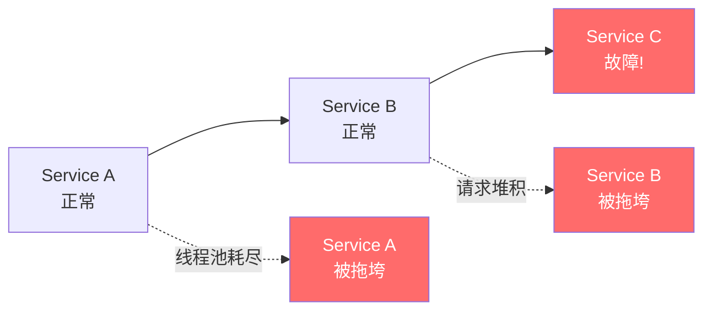
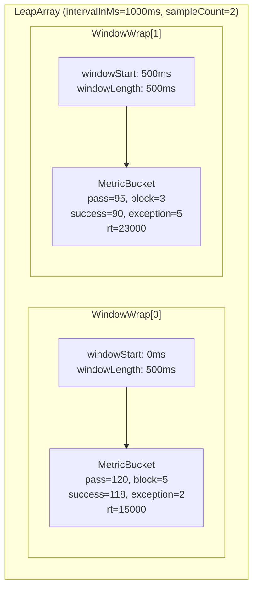
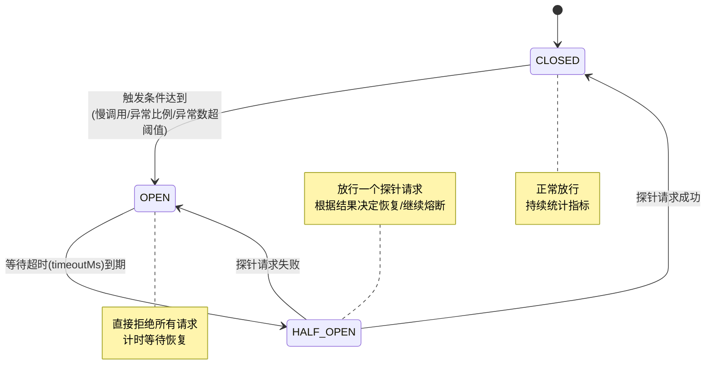
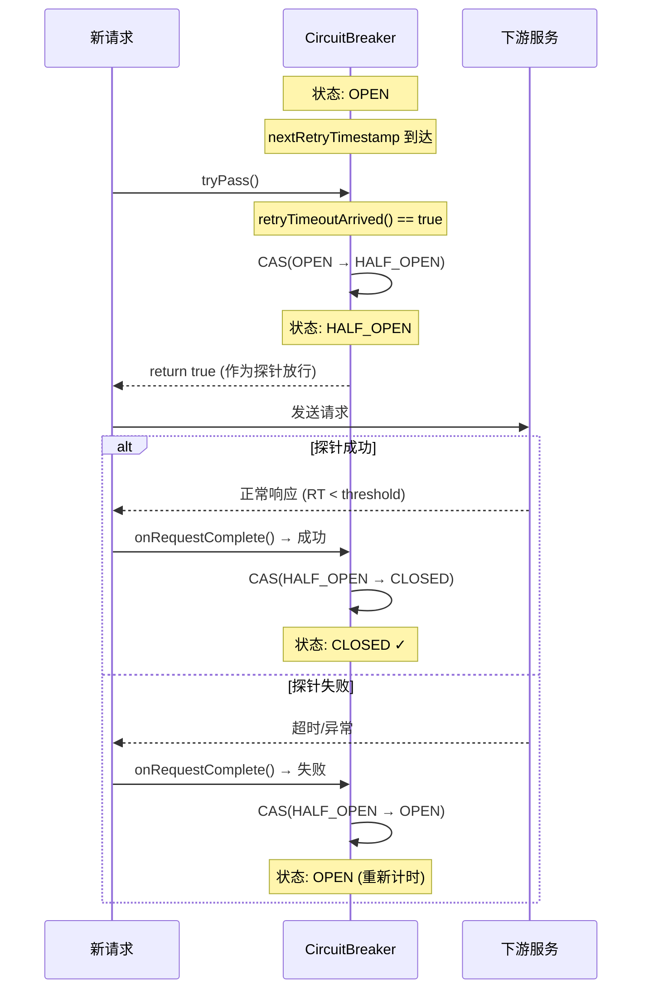
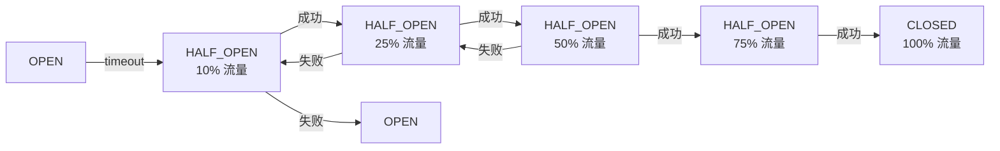
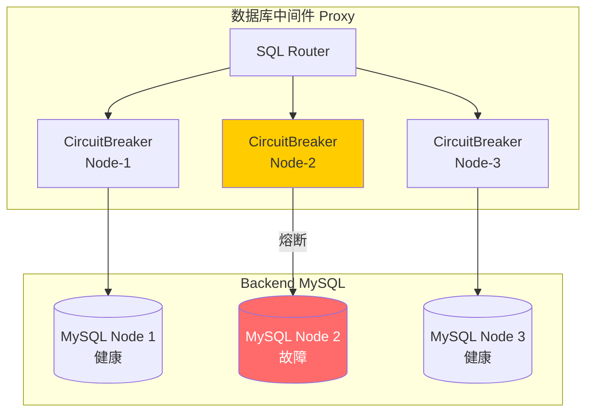

# Sentinel 熔断机制深度拆解：滑动窗口、半开状态与恢复策略

> **摘要**：Sentinel 是阿里巴巴开源的流量治理组件，其熔断降级机制通过滑动窗口统计、三状态机模型和恢复策略三大支柱，实现了对微服务的精准保护。本文将从源码层面深入剖析这三大核心机制的设计与实现，并结合数据库中间件场景探讨熔断策略的应用。

---

## 1. 背景：为什么需要熔断

### 1.1 级联故障（Cascading Failure）

在微服务架构中，服务之间形成复杂的调用链。当一个下游服务出现故障（如响应变慢或完全不可用）时，上游服务的线程池会被阻塞等待的请求耗尽，进而导致上游也变得不可用——这就是**级联故障**。



典型场景：数据库中间件 Proxy 连接的某个后端 MySQL 节点变慢（如磁盘 I/O 打满），如果不加保护，所有经过该节点的请求都会堆积，最终拖垮整个 Proxy。

### 1.2 熔断器模式

熔断器（Circuit Breaker）的概念最早由 Michael Nygard 在《Release It!》一书中提出，灵感来源于电路中的保险丝——当电流过大时自动断开，保护整个电路。

核心思想：**快速失败（Fail Fast）**。当检测到下游服务异常时，不再发送请求，而是直接返回降级结果，避免无效等待和资源浪费。

### 1.3 Sentinel vs Hystrix vs Resilience4j

| 特性 | Sentinel | Hystrix | Resilience4j |
|------|---------|---------|-------------|
| **维护状态** | 活跃（阿里持续维护） | 停止维护（Netflix） | 活跃（社区驱动） |
| **核心理念** | 以流量为切入点 | 隔离 + 熔断 | 函数式 + 轻量级 |
| **隔离模型** | 信号量 | 线程池 / 信号量 | 信号量 |
| **统计模型** | 滑动窗口（LeapArray） | 滑动窗口（RxJava） | 环形缓冲区 |
| **扩展能力** | Slot Chain 插件机制 | 较弱 | Decorator 模式 |
| **Dashboard** | 内建 Sentinel Dashboard | Hystrix Dashboard | 需第三方 |

Sentinel 的独特之处在于：它不仅仅是熔断器——它是一个**完整的流量治理框架**，涵盖流控、熔断、系统保护、热点防护等多维度能力。

---

## 2. Sentinel 整体架构

### 2.1 核心概念

- **Resource（资源）**：被保护的对象，可以是一个方法、一个接口、一段代码
- **Entry（入口）**：每次访问资源时创建的入口令牌
- **Slot Chain（插槽链）**：对资源访问进行各维度检查的责任链

### 2.2 Slot Chain 责任链

Sentinel 的核心处理逻辑通过 Slot Chain 实现——每个 Slot 负责一个维度的检查：


| Slot | 职责 |
|------|------|
| **NodeSelectorSlot** | 构建资源的调用树结构（入口 → 资源的调用路径） |
| **ClusterBuilderSlot** | 构建资源的集群级别统计节点（ClusterNode） |
| **StatisticSlot** | **核心**：基于滑动窗口的实时指标统计（QPS、RT、异常数） |
| **FlowSlot** | 流量控制：QPS 限流、并发限流 |
| **DegradeSlot** | **熔断降级**：基于慢调用/异常比例/异常数触发熔断 |

### 2.3 请求处理流程

```java
// 应用代码
Entry entry = null;
try {
    entry = SphU.entry("myResource");  // 获取入口
    // ↓ Slot Chain 依次执行
    // NodeSelectorSlot.entry() → pass
    // ClusterBuilderSlot.entry() → pass
    // StatisticSlot.entry() → 记录请求开始
    // FlowSlot.entry() → 检查是否限流 → pass/block
    // DegradeSlot.entry() → 检查是否熔断 → pass/block
    
    // 业务逻辑
    doSomething();
    
} catch (BlockException e) {
    // 被限流或熔断 → 执行降级逻辑
    handleFallback();
} finally {
    if (entry != null) {
        entry.exit();  // StatisticSlot 记录响应时间和成功/失败
    }
}
```

---

## 3. 滑动窗口统计（Sliding Window）

### 3.1 为什么需要滑动窗口

**固定窗口的问题：临界突变**

假设限流阈值为 100 QPS，固定窗口为 1 秒：

```
|---- Window 1 (00:00-00:01) ----|---- Window 2 (00:01-00:02) ----|
                         [90 req] [90 req]
                              ↑ 在 00:00.9 ~ 00:01.1 的 200ms 内有 180 请求
                                实际瞬时 QPS = 900，远超阈值！
```

在窗口临界处，两个窗口各自未超限，但实际瞬时流量已经远超阈值。

**滑动窗口的解决：平滑统计**

滑动窗口将一个统计周期划分为多个小窗口，统计时覆盖当前时间往前的整个周期：

```
|--W1--|--W2--|--W3--|--W4--|  (4 个小窗口，总周期 1s)
   250ms 250ms 250ms 250ms
        ↑ 统计范围随时间滑动
```

### 3.2 Sentinel 的滑动窗口实现：LeapArray

`LeapArray` 是 Sentinel 滑动窗口的核心数据结构。

```java
// 源码路径: com.alibaba.csp.sentinel.slots.statistic.base.LeapArray

public abstract class LeapArray<T> {
    
    // 小窗口长度（毫秒）
    protected int windowLengthInMs;
    
    // 小窗口数量
    protected int sampleCount;
    
    // 统计周期（毫秒）= windowLengthInMs * sampleCount
    protected int intervalInMs;
    
    // 核心：环形数组，存储所有小窗口
    protected final AtomicReferenceArray<WindowWrap<T>> array;
}
```

#### 数据结构关系



#### MetricBucket 统计维度

```java
// 源码路径: com.alibaba.csp.sentinel.slots.statistic.data.MetricBucket

public class MetricBucket {
    // 使用 LongAdder 实现高并发无锁累加
    private final LongAdder[] counters;
    
    // 统计维度枚举
    // PASS: 通过的请求数
    // BLOCK: 被拒绝的请求数
    // EXCEPTION: 异常请求数
    // SUCCESS: 成功请求数
    // RT: 总响应时间（用于计算平均 RT）
    // OCCUPIED_PASS: 预占通过数
}
```

### 3.3 关键源码分析：窗口定位

`currentWindow()` 是 LeapArray 最核心的方法——根据当前时间定位到对应的小窗口：

```java
// 源码路径: LeapArray#currentWindow(long timeMillis)

public WindowWrap<T> currentWindow(long timeMillis) {
    if (timeMillis < 0) {
        return null;
    }
    
    // 1. 计算当前时间落在哪个窗口（取模定位）
    int idx = calculateTimeIdx(timeMillis);
    long windowStart = calculateWindowStart(timeMillis);
    
    // 2. 自旋 + CAS 获取/创建窗口
    while (true) {
        WindowWrap<T> old = array.get(idx);
        
        if (old == null) {
            // Case 1: 该位置为空 → 创建新窗口
            WindowWrap<T> window = new WindowWrap<>(
                windowLengthInMs, windowStart, newEmptyBucket(timeMillis));
            if (array.compareAndSet(idx, null, window)) {
                return window;  // CAS 成功，返回新窗口
            } else {
                Thread.yield();  // CAS 失败，让出 CPU 重试
            }
            
        } else if (windowStart == old.windowStart()) {
            // Case 2: 窗口存在且未过期 → 直接复用
            return old;
            
        } else if (windowStart > old.windowStart()) {
            // Case 3: 窗口已过期 → 重置复用（关键！）
            if (updateLock.tryLock()) {
                try {
                    return resetWindowTo(old, windowStart);
                } finally {
                    updateLock.unlock();
                }
            } else {
                Thread.yield();
            }
        }
        // Case 4: windowStart < old.windowStart() 
        // 时钟回拨，理论上不应该发生
    }
}

// 时间轮索引计算
private int calculateTimeIdx(long timeMillis) {
    long timeId = timeMillis / windowLengthInMs;
    return (int)(timeId % array.length());
}

// 窗口起始时间计算
private long calculateWindowStart(long timeMillis) {
    return timeMillis - timeMillis % windowLengthInMs;
}
```

**核心设计思想**：

1. **时间轮取模**：`idx = (time / windowLength) % arrayLength`，将时间映射到固定大小的数组索引
2. **CAS 无锁创建**：多线程同时创建新窗口时，通过 CAS 保证只有一个线程成功
3. **过期窗口重置复用**：不分配新内存，而是将过期窗口的统计数据清零后复用——这是高性能的关键

#### resetWindowTo 的无锁设计

```java
// 重置过期窗口
private WindowWrap<T> resetWindowTo(WindowWrap<T> w, long startTime) {
    // 重置窗口起始时间
    w.resetTo(startTime);
    // 重置统计数据（MetricBucket 内部的 LongAdder 全部归零）
    w.value().reset();
    return w;
}
```

### 3.4 配置参数

| 参数 | 默认值 | 说明 |
|------|--------|------|
| `sampleCount` | 2 | 小窗口数量 |
| `intervalInMs` | 1000 | 统计周期（毫秒） |
| 窗口长度 | 500ms | = intervalInMs / sampleCount |

例如：`sampleCount=10, intervalInMs=10000` → 每个小窗口 1s，总统计周期 10s。

### 3.5 完整的窗口更新流程

```mermaid
flowchart TD
    A[请求到达] --> B[计算当前时间 timeMillis]
    B --> C["计算索引 idx = (timeMillis/windowLen) % arrayLen"]
    C --> D[读取 array[idx]]
    
    D --> E{array[idx] == null?}
    E -->|Yes| F[CAS 创建新 WindowWrap]
    F -->|CAS 成功| G[返回新窗口]
    F -->|CAS 失败| H[Thread.yield + 重试]
    
    E -->|No| I{windowStart 匹配?}
    I -->|匹配| J[直接返回当前窗口]
    I -->|已过期| K[tryLock + resetWindowTo]
    K --> L[返回重置后的窗口]
    
    G --> M[在 MetricBucket 中累加统计]
    J --> M
    L --> M
```

---

## 4. 熔断状态机（Circuit Breaker State Machine）

### 4.1 三状态模型



### 4.2 状态语义

| 状态 | 行为 | 统计 |
|------|------|------|
| **CLOSED** | 所有请求正常放行 | 持续统计慢调用比例、异常比例、异常数 |
| **OPEN** | 所有请求直接拒绝（抛出 `DegradeException`） | 不统计，只计时 |
| **HALF_OPEN** | 放行一个探针请求，其余拒绝 | 只关注探针结果 |

### 4.3 触发条件

Sentinel 支持三种熔断策略：

```java
// 源码路径: com.alibaba.csp.sentinel.slots.block.degrade.DegradeRule

public class DegradeRule extends AbstractRule {
    // 熔断策略
    private int grade;  
    // DEGRADE_GRADE_RT = 0          → 慢调用比例
    // DEGRADE_GRADE_EXCEPTION_RATIO = 1 → 异常比例
    // DEGRADE_GRADE_EXCEPTION_COUNT = 2 → 异常数
    
    private double count;        // 阈值
    private int timeWindow;      // 熔断持续时间（秒）
    private int minRequestAmount; // 最小请求数（防止样本过少误判）
    private double slowRatioThreshold; // 慢调用比例阈值
    private int statIntervalMs;  // 统计周期
}
```

**状态转换条件详解：**

```
CLOSED → OPEN 的判定：
  1. 在一个统计周期（statIntervalMs）内
  2. 总请求数 >= minRequestAmount（防止样本不足）
  3. 满足以下任一条件：
     - 慢调用比例策略：慢调用请求占比 >= slowRatioThreshold
     - 异常比例策略：异常请求占比 >= count
     - 异常数策略：异常请求总数 >= count

OPEN → HALF_OPEN：
  - 从 OPEN 状态开始计时，经过 timeWindow 秒后自动进入 HALF_OPEN

HALF_OPEN → CLOSED：
  - 探针请求执行成功（未触发慢调用/异常）

HALF_OPEN → OPEN：
  - 探针请求执行失败（触发了慢调用/异常），重新计时
```

### 4.4 源码实现

#### CircuitBreaker 接口

```java
// 源码路径: com.alibaba.csp.sentinel.slots.block.degrade.circuitbreaker

public interface CircuitBreaker {
    DegradeRule getRule();
    boolean tryPass(Context context);    // 尝试通过
    State currentState();                // 当前状态
    void onRequestComplete(Context context); // 请求完成回调
}

public enum State {
    OPEN,       // 熔断打开
    HALF_OPEN,  // 半开
    CLOSED      // 关闭（正常）
}
```

#### AbstractCircuitBreaker 核心实现

```java
public abstract class AbstractCircuitBreaker implements CircuitBreaker {
    
    // 状态：使用 AtomicReference + CAS 保证线程安全
    protected final AtomicReference<State> currentState 
        = new AtomicReference<>(State.CLOSED);
    
    // 探针计数器：HALF_OPEN 时只允许一个探针
    protected final AtomicLong retryTimeoutArrived = new AtomicLong(0);
    
    // 下一次重试时间点
    protected volatile long nextRetryTimestamp;
    
    @Override
    public boolean tryPass(Context context) {
        // 1. CLOSED 状态 → 直接放行
        if (currentState.get() == State.CLOSED) {
            return true;
        }
        
        // 2. OPEN 状态 → 检查是否到达重试时间
        if (currentState.get() == State.OPEN) {
            if (retryTimeoutArrived()) {
                // 尝试从 OPEN 切换到 HALF_OPEN
                if (fromOpenToHalfOpen(context)) {
                    return true;  // 作为探针放行
                }
            }
            return false;  // 未到重试时间，拒绝
        }
        
        // 3. HALF_OPEN 状态 → 拒绝（已有探针在运行）
        return false;
    }
    
    protected boolean retryTimeoutArrived() {
        return TimeUtil.currentTimeMillis() >= nextRetryTimestamp;
    }
    
    // OPEN → HALF_OPEN 的状态切换
    protected boolean fromOpenToHalfOpen(Context context) {
        // CAS 保证只有一个线程能切换
        if (currentState.compareAndSet(State.OPEN, State.HALF_OPEN)) {
            // 通知监听器
            notifyObservers(State.OPEN, State.HALF_OPEN, null);
            return true;
        }
        return false;
    }
    
    // HALF_OPEN → CLOSED 的状态切换
    protected void fromHalfOpenToClosed() {
        if (currentState.compareAndSet(State.HALF_OPEN, State.CLOSED)) {
            resetStat();  // 重置统计窗口
            notifyObservers(State.HALF_OPEN, State.CLOSED, null);
        }
    }
    
    // HALF_OPEN → OPEN 的状态切换（探针失败）
    protected void fromHalfOpenToOpen(double snapshotValue) {
        if (currentState.compareAndSet(State.HALF_OPEN, State.OPEN)) {
            updateNextRetryTimestamp();  // 重新计算下次重试时间
            notifyObservers(State.HALF_OPEN, State.OPEN, snapshotValue);
        }
    }
}
```

#### 慢调用比例熔断器

```java
// 源码路径: ResponseTimeCircuitBreaker

public class ResponseTimeCircuitBreaker extends AbstractCircuitBreaker {
    
    private final long maxAllowedRt;       // 慢调用 RT 阈值
    private final double maxSlowRequestRatio; // 慢调用比例阈值
    
    @Override
    public void onRequestComplete(Context context) {
        // 获取本次请求的 RT
        long rt = context.getCurEntry().getRt();
        
        if (currentState.get() == State.HALF_OPEN) {
            // 半开状态：判断探针结果
            if (rt > maxAllowedRt) {
                // 探针是慢调用 → 切回 OPEN
                fromHalfOpenToOpen(1.0);
            } else {
                // 探针成功 → 切到 CLOSED
                fromHalfOpenToClosed();
            }
            return;
        }
        
        // CLOSED 状态：累加统计
        // 记录慢调用
        if (rt > maxAllowedRt) {
            slowCounter.add(1);
        }
        totalCounter.add(1);
        
        // 检查是否达到熔断条件
        handleStateChangeWhenThresholdExceeded(rt);
    }
    
    private void handleStateChangeWhenThresholdExceeded(long rt) {
        // 请求数不足，不做判断
        if (totalCounter.sum() < minRequestAmount) {
            return;
        }
        
        double slowRatio = slowCounter.sum() * 1.0 / totalCounter.sum();
        
        if (slowRatio > maxSlowRequestRatio) {
            // 慢调用比例超阈值 → CLOSED → OPEN
            if (currentState.compareAndSet(State.CLOSED, State.OPEN)) {
                updateNextRetryTimestamp();
                notifyObservers(State.CLOSED, State.OPEN, slowRatio);
            }
        }
    }
}
```

---

## 5. 半开状态（HALF_OPEN）深度分析

### 5.1 设计目标

半开状态存在的意义是**自动恢复探测**——当下游服务恢复时，熔断器能自动检测到并恢复正常调用，无需人工介入。

### 5.2 探针机制详解



### 5.3 并发控制

**同一时刻只允许一个探针请求**——这通过 `CAS(OPEN → HALF_OPEN)` 自然实现：

```java
// 多线程同时到达 HALF_OPEN 入口
Thread-1: currentState.compareAndSet(OPEN, HALF_OPEN) → true  ✓ 探针放行
Thread-2: currentState.compareAndSet(OPEN, HALF_OPEN) → false ✗ 拒绝
Thread-3: currentState.get() == HALF_OPEN → false             ✗ 拒绝
```

CAS 操作保证了原子性——只有第一个到达的线程能成功将状态从 OPEN 切换到 HALF_OPEN 并成为探针。

### 5.4 振荡问题与改进

**问题：OPEN ↔ HALF_OPEN 振荡**

当下游服务处于"半死不活"状态时（时好时坏），可能出现：

```
OPEN → (timeout) → HALF_OPEN → (探针失败) → OPEN → (timeout) → HALF_OPEN → ...
```

反复振荡，造成周期性的请求失败。

**改进思路：**

1. **指数退避超时**：每次从 HALF_OPEN 回到 OPEN 时，将 `timeoutMs` 加倍

```java
// 指数退避改进（伪代码）
void fromHalfOpenToOpen() {
    consecutiveOpenCount++;
    long backoff = Math.min(
        baseTimeout * (1L << consecutiveOpenCount),
        maxTimeout  // 上限，如 60s
    );
    nextRetryTimestamp = System.currentTimeMillis() + backoff;
}
```

1. **多次探针确认**：要求连续 N 次探针成功才恢复

```java
// 多次确认改进（伪代码）
int requiredSuccessCount = 3;
AtomicInteger probeSuccessCount = new AtomicInteger(0);

void onProbeComplete(boolean success) {
    if (success) {
        if (probeSuccessCount.incrementAndGet() >= requiredSuccessCount) {
            fromHalfOpenToClosed();
        }
        // 否则继续保持 HALF_OPEN，等待下一个探针
    } else {
        probeSuccessCount.set(0);
        fromHalfOpenToOpen();
    }
}
```

---

## 6. 恢复策略（Recovery Strategy）

### 6.1 Sentinel 内置恢复策略

Sentinel 目前内置的恢复策略较为简单：

- **固定超时恢复**：OPEN 状态持续 `timeWindow` 秒后进入 HALF_OPEN
- **单次探针恢复**：一次探针成功即切回 CLOSED

这种策略简单可靠，但在复杂场景下可能不够精细。

### 6.2 高级恢复策略设计

#### 6.2.1 渐进式恢复（Gradual Recovery）

半开状态不是"全通或全断"，而是逐步放大流量比例：

```java
// 渐进式恢复（设计方案）
class GradualRecoveryStrategy {
    private double[] recoverySteps = {0.1, 0.25, 0.5, 0.75, 1.0};
    private int currentStep = 0;
    
    boolean shouldPass(long requestId) {
        double ratio = recoverySteps[currentStep];
        // 按比例放行
        return (requestId % 100) < (ratio * 100);
    }
    
    void onStepSuccess() {
        // 当前比例下成功率达标 → 提升比例
        if (currentStep < recoverySteps.length - 1) {
            currentStep++;
        } else {
            // 100% 放行成功 → 恢复 CLOSED
            circuitBreaker.close();
        }
    }
    
    void onStepFailure() {
        // 当前比例下失败率超标 → 回退到上一步或重新 OPEN
        currentStep = Math.max(0, currentStep - 1);
        if (failureCount > threshold) {
            circuitBreaker.open();
        }
    }
}
```



#### 6.2.2 指数退避（Exponential Backoff）

连续熔断时，增大恢复等待时间：

```java
class ExponentialBackoffStrategy {
    private long baseTimeout = 5000;   // 5s
    private long maxTimeout = 60000;   // 60s
    private int consecutiveTrips = 0;  // 连续触发次数
    
    long getNextTimeout() {
        long timeout = baseTimeout * (1L << Math.min(consecutiveTrips, 10));
        return Math.min(timeout, maxTimeout);
    }
    
    void onTrip() {
        consecutiveTrips++;
    }
    
    void onRecover() {
        consecutiveTrips = 0;  // 恢复后重置
    }
}
```

退避效果：`5s → 10s → 20s → 40s → 60s（上限）`

#### 6.2.3 健康度评分（Health Score）

综合多个维度计算后端健康度：

```java
class HealthScoreStrategy {
    // 健康度 = 加权评分
    double calculateHealthScore(NodeMetrics metrics) {
        double rtScore = normalize(metrics.avgRt, 0, 1000);      // RT 评分
        double errorScore = 1.0 - metrics.errorRatio;             // 错误率评分
        double successScore = metrics.successRatio;                // 成功率评分
        
        // 加权
        return rtScore * 0.3 + errorScore * 0.4 + successScore * 0.3;
    }
    
    // 健康度 > 0.7 → CLOSED
    // 健康度 0.3 ~ 0.7 → HALF_OPEN（按比例放行）
    // 健康度 < 0.3 → OPEN
}
```

### 6.3 与数据库中间件的结合

在数据库中间件场景中，熔断策略有其特殊性：



**数据库级熔断的特殊考虑：**

1. **连接池级别的熔断**：不是按请求粒度，而是按连接池级别——当某个后端节点连续超时，熔断整个连接池
2. **读写分离场景**：RO 节点熔断后，流量自动迁移到其他 RO 节点；所有 RO 都熔断时，读请求回退到 RW 节点
3. **探针方式**：使用轻量级 `SELECT 1` 作为探针，而非实际业务 SQL
4. **渐进恢复更重要**：数据库节点恢复后，突然涌入全量流量可能再次压垮——必须渐进式放大

---

## 7. 完整示例与配置

### 7.1 Java 代码示例

```java
// 配置慢调用比例熔断规则
List<DegradeRule> rules = new ArrayList<>();
DegradeRule rule = new DegradeRule("myResource")
    .setGrade(RuleConstant.DEGRADE_GRADE_RT)           // 慢调用比例策略
    .setCount(200)                                       // 慢调用 RT 阈值：200ms
    .setSlowRatioThreshold(0.5)                          // 慢调用比例阈值：50%
    .setMinRequestAmount(10)                             // 最小请求数：10
    .setStatIntervalMs(10000)                            // 统计周期：10s
    .setTimeWindow(5);                                   // 熔断持续时间：5s
rules.add(rule);
DegradeRuleManager.loadRules(rules);

// 使用
Entry entry = null;
try {
    entry = SphU.entry("myResource");
    // 正常业务逻辑
    String result = callDownstreamService();
    return result;
} catch (BlockException e) {
    // 被熔断 → 降级逻辑
    return getDefaultValue();
} finally {
    if (entry != null) {
        entry.exit();
    }
}
```

### 7.2 配置参数详解

| 参数 | 类型 | 说明 | 建议值 |
|------|------|------|--------|
| `grade` | int | 熔断策略：0=慢调用比例，1=异常比例，2=异常数 | 根据场景选择 |
| `count` | double | 阈值（RT/比例/数量） | RT: 200-500ms; 比例: 0.5-0.8 |
| `timeWindow` | int | 熔断持续时间（秒） | 5-30s |
| `minRequestAmount` | int | 触发熔断的最小请求数 | 5-20 |
| `slowRatioThreshold` | double | 慢调用比例阈值 | 0.5-0.8 |
| `statIntervalMs` | int | 统计窗口周期（毫秒） | 10000-60000 |

### 7.3 调参建议

- **minRequestAmount 不要设太小**：设为 5 意味着只要 5 个请求中有 3 个慢调用就熔断，容易误判
- **timeWindow 不要设太短**：设为 1s 意味着每秒都有探针，恢复太激进
- **statIntervalMs 要和业务周期匹配**：如果业务有明显的波峰波谷，统计周期要覆盖至少一个完整周期

---

## 8. 总结与最佳实践

### 8.1 三大支柱

```
                    ┌─────────────────────────────────┐
                    │         Sentinel 熔断机制        │
                    └─────────────────────────────────┘
                                    │
                ┌───────────────────┼───────────────────┐
                ↓                   ↓                   ↓
        ┌──────────────┐   ┌──────────────┐   ┌──────────────┐
        │   滑动窗口    │   │   状态机      │   │   恢复策略    │
        │  (统计基石)   │   │  (决策骨架)   │   │  (灵魂所在)   │
        └──────────────┘   └──────────────┘   └──────────────┘
        LeapArray           CLOSED/OPEN/       固定超时
        时间轮取模          HALF_OPEN          指数退避
        CAS 无锁            CAS 状态转换      渐进恢复
        MetricBucket        探针机制           健康度评分
```

### 8.2 核心设计启示

1. **滑动窗口是精确统计的基石**：LeapArray 通过时间轮 + CAS + 窗口复用，在高并发下实现了零内存分配的实时统计
2. **状态机要简洁且线程安全**：三状态模型足够表达熔断语义；`AtomicReference + CAS` 保证了无锁状态转换
3. **恢复策略决定了生产可用性**：简单的"超时 + 单次探针"在复杂场景下不够用——渐进式恢复 + 指数退避才是生产级方案
4. **对中间件工程师的启示**：数据库中间件应该在连接池层面集成熔断能力，实现对后端节点的自动摘除与恢复

---

> **参考资料**：
>
> - Sentinel 源码：<https://github.com/alibaba/Sentinel>
> - Sentinel 官方文档：<https://sentinelguard.io/zh-cn/docs/introduction.html>
> - Michael Nygard《Release It! Design and Deploy Production-Ready Software》
> - Martin Fowler - Circuit Breaker Pattern：<https://martinfowler.com/bliki/CircuitBreaker.html>
